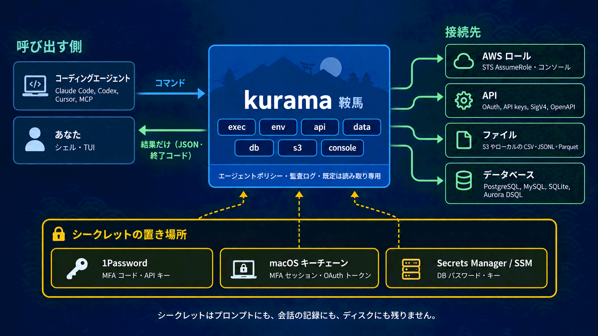

<!-- en: af93c18e224b -->
<p align="center">
  
</p>

<p align="center"><a href="README.md">English</a> · <strong>日本語</strong></p>

<h1 align="center">鞍馬 Kurama</h1>

<p align="center">
  <strong>あなたとコーディングエージェントのための、認証情報と API の道具。</strong><br>
  シークレットを一切渡さずに、AWS のロールや API、データをエージェントに使わせます。
</p>

<p align="center">
  <a href="https://github.com/ynishimura/kurama/actions/workflows/pr.yml"></a>
  <a href="https://scorecard.dev/viewer/?uri=github.com/ynishimura/kurama"></a>
  <a href="Cargo.toml"></a>
  <a href="#動作環境"></a>
  <a href="LICENSE"></a>
</p>

<p align="center">
  <a href="#コーディングエージェントのために">機 エージェント向け</a> ·
  <a href="#クイックスタート">始 クイックスタート</a> ·
  <a href="#機能">技 機能</a> ·
  <a href="#使い方">用 使い方</a> ·
  <a href="#設定">設 設定</a> ·
  <a href="#kurama-の目指すもの">志 目指すもの</a> ·
  <a href="#開発">和 開発に参加する</a>
</p>

---

**Kurama** は、コーディングエージェント（Claude Code、Codex、Cursor、自作のものなど）と、エージェントが使いたい先との間に入る認証情報のレイヤーです。使いたい先とは、MFA で守られた AWS のロール、OAuth や API キーで守られた API、S3 上のファイル、踏み台の向こうにあるデータベースです。エージェントは `kurama exec`、`kurama api`、`kurama data`、`kurama db` を実行するだけです。残りは kurama が引き受けます。1Password から MFA コードを取り出し、ロールを引き受け、シークレットストアからキーを読み、リクエストに署名して、結果だけを返します。シークレットがプロンプトや会話の記録、ディスクに入ることはありません。

<p align="center">
  
</p>

同じコマンドは、ターミナルの前にいる人にもそのまま使えます。シェルで AWS のロールを切り替え、AWS コンソールを開き、API の OpenAPI 定義を TUI で眺め、接続文字列を組み立てずにファイルやデータベースへクエリを投げられます。

```sh
kurama                            # Explore profiles in the TUI
kurama env dev                    # Switch your current shell to dev
kurama exec prod --readonly -- aws s3 ls
kurama console dev                # Open the AWS console
kurama login github               # OAuth: authorize in the browser, store the token
kurama api github /user --jq .login
kurama api github                 # Explore the API's OpenAPI description in the TUI
kurama api github issues/create -P owner=o -P repo=r -d '{"title":"x"}'
kurama preset add openai --set secret=op://Agent/openai/credential   # an API in one command
kurama data ./events.jsonl --query 'SELECT count(*) FROM data'
kurama db app --tables
```

<p align="center">
  
</p>

## コーディングエージェントのために
<!-- en: 37d1ec3dccae -->

エージェントが仕事をするのに、AWS のキーや API トークンを読む必要はないはずです。CLI の使い方を当て推量で探る必要もないはずです。kurama はこの 2 点を軸に作られています。

| エージェントに必要なこと | kurama が用意するもの |
| --- | --- |
| キーを見ずに API を呼ぶ | `kurama api <API> <path or operation>` が 1Password、Secrets Manager、Parameter Store から認証情報を読み、リクエストに付けます。返ってくるのはレスポンスだけです。 |
| AWS の認証情報でツールを動かす | `kurama exec <profile> -- <command>` は、ロールの認証情報をそのコマンドの環境にだけ渡します。ファイルにも stdout にも出ません。 |
| 実行前にコマンドを知る | `kurama agent` が、インストール済みのバージョンの契約を表示します。コマンド、JSON のフィールド、終了コード、ソースの追加方法が載っています。`kurama agent --json` は同じ内容を 1 つのカタログとして出力します。 |
| 呼ぶ前に API を知る | `kurama api <API> --schema` が、すべてのオペレーションを網羅した JSON の契約を 1 つ出力します。`--skill` を付けると Agent Skill（`SKILL.md`）になります。 |
| 呼び出しが何をするか知る | `--dry-run --json` は、すべての認証情報を伏せたリクエストと、実行した場合に起きる作用を 1 つずつ表示します。作用とは、API リクエスト、1Password の読み取り、STS の呼び出し、ブラウザの起動です。 |
| 失敗から立て直す | `--json` か `--jq` を付けると、失敗は stderr に 1 つの JSON ドキュメントとして出ます。中身は `code`、`category`、`exit_code`、`message`、`hint`、`retry`、`next_actions` です。 |
| 手を止めて人に頼むべき時を知る | 終了コード 3 は、人の操作が必要という意味です（ログインの承認、1Password のロック解除など）。エラーには、人に渡すべきコマンドが書かれています。ターミナルがなければ、プロンプトで待ち続けることはありません。 |
| 無人で動く | キーチェーンから読んだ 1Password のサービスアカウントトークンで、MFA コードとシークレットをプロンプトなしで取得します。キャッシュした 1 つの MFA セッションで、その背後にあるすべてのロールをまかなえます。 |

契約は一度エージェントに渡しておくだけです。

```bash
kurama agent install   # ~/.claude/skills/kurama/SKILL.md, and one Skill per API
                       # generated from its description (kurama-api-<name>/SKILL.md)
```

あとは「自分の GitHub の未解決 Issue を一覧にして」「S3 にある先月の orders は何行？」のように普通の言葉で頼めば、エージェントが kurama を実行します。

```bash
kurama api github issues/list-for-authenticated-user -P state=open --jq '.[].title'
kurama data 's3://my-bucket/orders/2026-08.parquet' --aws-profile ops --query 'SELECT count(*) FROM data' --json
```

人は同じソースを TUI で使えます。ホーム画面のタブ、どのソースにも飛べる `Ctrl-K`、API・データベース・バケットごとのエクスプローラーがあります。

<p align="center">
  
</p>

<p align="center">
  
</p>

## 機能
<!-- en: 40168095822d -->

<table>
  <tr>
    <td width="50%"><strong>探して、選んで、切り替える</strong><br>TUI でプロファイルを見つけ、セッションの状態を確かめ、Enter で使い始めます。</td>
    <td width="50%"><strong>MFA の繰り返しを減らす</strong><br>1Password からコードを取得し、macOS キーチェーンを通じて MFA セッションを使い回します。</td>
  </tr>
  <tr>
    <td><strong>すぐ作業に入れるシェル</strong><br>一時的な認証情報を zsh にエクスポートします。プロファイルの補完も組み込み済みです。</td>
    <td><strong>1 コマンドに 1 つの環境</strong><br><code>exec</code> を使えば、1 つのコマンドにだけ認証情報を渡し、今のシェルはそのままにできます。</td>
  </tr>
  <tr>
    <td><strong>読み取り専用セッションとコンソール</strong><br>AWS の <code>ReadOnlyAccess</code> ポリシーを付けたり、フェデレーションでコンソールのセッションを開いたりできます。</td>
    <td><strong>スクリプトやエージェントからも使いやすい</strong><br>構造化された JSON、予測できる終了コード、データ専用の stdout、そしてインストール済みのバージョンの契約を示す <code>kurama agent</code> を備えています。</td>
  </tr>
  <tr>
    <td><strong>OAuth ソース</strong><br>PKCE 付きの認可コード、デバイスコード、クライアントクレデンシャルに対応します。トークンは自動で更新され、キーチェーンに保存されます。</td>
    <td><strong>トークンを知っている API クライアント</strong><br><code>kurama api</code> はベアラートークンを送り、401 のあとに一度だけ再試行し、<code>--jq</code> で JSON を絞り込みます。</td>
  </tr>
  <tr>
    <td><strong>OpenAPI エクスプローラー</strong><br><code>openapi</code> に定義を指定すれば、オペレーションを眺め、フォームに入力してリクエストを送り、結果を jq で絞り込み、同じ呼び出しを再現するコマンドをコピーできます。</td>
    <td><strong>オペレーションを名前で呼ぶ</strong><br><code>--ops</code> でオペレーションを一覧し、<code>--describe</code> でパラメーター、ボディのひな形、レスポンスの形を確認できます。<code>kurama api &lt;API&gt; &lt;OP&gt; -P name=value</code> は、各パラメーターをあるべき場所に入れて送ります。</td>
  </tr>
  <tr>
    <td><strong>API が求める形で API キーを送る</strong><br>キーは呼び出しのたびに 1Password か AWS から読み、保存はしません。送り方は、ベアラートークン、名前付きヘッダー、HTTP Basic、クエリパラメーターから選べます。</td>
    <td><strong>よく使う API のプリセット</strong><br><code>kurama preset add</code> が GitHub、Google、Linear、OpenAI、Slack、Jira、Zendesk、Backlog などの設定セクションを書き込みます。セクションは省略せずに書き出すので、各認証情報がどこに入るかはファイルを見ればわかります。</td>
  </tr>
  <tr>
    <td><strong>ローカルと S3 のファイル</strong><br><code>kurama data</code> は、組み込みの DuckDB で CSV、JSONL、Parquet に読み取り専用の SQL を実行します。行数とバイト数には上限があります。</td>
    <td><strong>データベースは既定で読み取り専用</strong><br><code>kurama db</code> は SQLite、PostgreSQL、MySQL、Aurora DSQL を、SSM の踏み台経由や IAM 認証で読み取ります。書き込むには、明示的な許可が 2 つ必要です。</td>
  </tr>
</table>

## クイックスタート
<!-- en: ab843365046e -->

kurama をインストールしてシェル連携を有効にし、既存の AWS ロールのプロファイルを 1 つ選びます。以下の例では `dev` という名前のプロファイルを使います。API から始めたい場合は [`kurama preset`](#設定) を参照してください。

### 動作環境
<!-- en: 47a4d9c34a66 -->

kurama は macOS と zsh（macOS の既定のシェル）を対象にしています。MFA セッションキャッシュと OAuth トークンの保存先は、ログインキーチェーンです。

Linux（`x86_64` と `aarch64`、glibc）でもビルドと実行ができます。ただし Linux にはキーチェーンがないため、MFA セッションと OAuth トークンは実行のたびに取得し直します。また 1Password のサービスアカウントトークンは `OP_SERVICE_ACCOUNT_TOKEN` から渡す必要があります。Linux 版は、実際に動かした記録による検証がまだありません。テストは macOS で実行しています。Windows と musl ターゲットには対応していません。ビルドすると、ターゲット名を示すメッセージを出して止まります。

- `~/.aws/config` にある AWS ロールのプロファイルと、その元になる認証情報へのアクセス
- MFA が必要なプロファイルと `op://` シークレットのための [1Password CLI](https://developer.1password.com/docs/cli/)（`op`）。アイテムの用意は[設定](#設定)で説明します

### インストール
<!-- en: 82c9c4fd8fc7 -->

リリースごとに、macOS（Apple シリコンと Intel）と Linux（x86_64 と arm64）向けのビルド済みバイナリを公開しています。

```bash
brew install ynishimura/tap/kurama
# or, without Homebrew, into ~/.cargo/bin:
curl --proto '=https' --tlsv1.2 -LsSf https://github.com/ynishimura/kurama/releases/latest/download/kurama-installer.sh | sh
```

ソースからビルドするには、[rustup](https://rustup.rs) で入れた Rust ツールチェーン（1.95.0 以降）と、`PATH` に通した `~/.cargo/bin` が必要です。

```bash
git clone https://github.com/ynishimura/kurama.git
cd kurama
cargo xtask install-signed        # -> ~/.cargo/bin/kurama
```

`install-signed` はバイナリをビルドし、固定のローカル ID で署名してインストールします。続いてログインキーチェーンのパスワードを一度だけ尋ねます。これで、このビルドが kurama の使うキーチェーン項目を読めるようになります。以後は再ビルドしてもダイアログは出ません。最初の一度だけ必要な証明書の準備は `docs/development/setup.md` にあります。`cargo install --locked --path .` でもインストールできますが、署名が置き換わるため、キーチェーンがまた尋ねてきます。

次に、`~/.zshrc` の `compinit` より後に 1 行追加します。

```zsh
eval "$(kurama init zsh)"
```

この行は `kurama` というシェル関数を定義し、エクスポートした認証情報が今のシェルに入るようにします。タブ補完も登録します。新しいシェルを開いて確かめてください。

```bash
kurama --version
whence -w kurama   # kurama: function
```

タブ補完の対象は次のとおりです。

- `env`、`exec`、`login`、`logout`、`status` の認証情報ソース名
- `console` の AWS プロファイル名と、`token` の認証ソース名
- `api` と `--describe` の API 名とオペレーション ID

候補にはそれぞれ説明が付きます。オペレーションでは、`-P` が `name=` を末尾の空白なしで提示します。必須パラメーターが先に並び、指定済みの名前は出てきません。`=` の後では、定義にある enum の値、真偽値、デフォルト値、例を補完します。

`--jq` は、API の `openapi` 定義からレスポンスのフィールドを補完します。`.content[].name` のようなパスや、`'.content[] | select(.na'` のようなクォート付きの式にも対応します。単語は閉じないので、書きかけのクォート付きの式をそのまま打ち続けられます。単純なパスの場合、補完に使うのは `-X` で指定したメソッドのレスポンスです。`-X` がなければ、`-d` があるときは POST、ないときは GET のレスポンスを使います。`--json` を付けると、フィールドは `.body` の下に置かれます。この補完には、API プロファイルに `openapi` が必要です。スキーマが空の場合や、辞書だけのスキーマには候補がありません。レスポンスのスキーマは深さ 6 までたどり、`oneOf` / `anyOf` は最初の分岐だけを使います。候補はスキーマに従うので、実際のレスポンスと違っていても変わりません。`map({a: .x}) | .[0].` のように変換した出力は推測しません。

補完が読むのは設定と、ローカルまたはキャッシュ済みの OpenAPI ファイルです。そのため、URL で指定した定義がまだキャッシュされていなければ、オペレーションの候補は出ません。補完が認証したり、定義を取得したり、キャッシュを変更したりすることはありません。

補完は、スクリプトを出力したバイナリを絶対パスで呼び出し、シェルのラッパーを通りません。バイナリを切り替えたら `eval` の行を実行し直してください。`fpath` を自分で管理している場合は、補完スクリプトだけを出力する `kurama completions zsh` を使えます。

### 最初の切り替え
<!-- en: d7e9426cf774 -->

```bash
kurama status                # See the profiles available in ~/.aws/config
kurama env dev               # Export temporary credentials into this shell
kurama unset                 # Clear the credentials when you are done
```

プロファイルを一覧から選びたい場合は、ターミナルで `kurama` を実行してください。スクリプトやエージェントからは、まず `kurama exec dev -- <command>` を使います。

<details>
<summary><strong>アップデートとアンインストール</strong></summary>

### アップデート
<!-- en: f7a430b0e576 -->

```bash
brew upgrade kurama                          # a Homebrew install
cd kurama && git pull && cargo xtask install-signed   # a build from source
```

シェルインストーラーで入れた場合は、インストーラーをもう一度実行します。そのあと新しいシェルを開くか `eval` の行を実行し直し、ラッパーと補完を新しいバイナリのものにしてください。新しいバイナリは、キーチェーン項目ごとに一度アクセスの許可を求めることがあります。[キーチェーンのプロンプト](#mfa-セッションキャッシュ)を参照してください。

この最初の許可はターミナルから行ってください。macOS はキーチェーンへのアクセスをバイナリの署名ごとに許可しますが、ターミナルがないと承認するプロンプトが出ません。その場合は読み取りが `macOS denied this build access to the keychain entry` で失敗し、`kurama status` はセッションを `unreadable` と表示し、`env` / `exec` はキャッシュを使わずに新しい MFA セッションを取得します。ターミナルで一度承認すれば解決します。

### アンインストール
<!-- en: f34b5fd64ee6 -->

```bash
kurama logout --all      # optional: remove cached MFA sessions and OAuth tokens from the keychain
brew uninstall kurama    # or: cargo uninstall kurama, or rm ~/.cargo/bin/kurama
```

そのあと `~/.zshrc` から `eval "$(kurama init zsh)"` の行を削除します。設定は `~/.config/kurama/` に残ります。

</details>
## 使い方
<!-- en: 6e2ae7447b12 -->

```bash
kurama                       # TUI: pick a profile (needs a terminal)

kurama env dev               # assume the role and export the credentials into this shell
kurama env prod --readonly   # attach the ReadOnlyAccess policy to the session
kurama env dev --json        # credential_process JSON on stdout, no shell changes
kurama exec dev -- aws s3 ls  # run one command with the credentials; this shell is unchanged
kurama console prod          # assume the role and open the AWS console

kurama login ops             # get and cache an MFA session now (no-op while one is valid)
kurama login ops --force     # replace the cached session
kurama status                # profiles, sources and APIs with their state; * marks what this shell holds
kurama status --json         # the same as one JSON array
kurama config check          # every problem in config.toml at once; no secret store, keychain or network
kurama config show auth.github   # the saved values, literal secrets redacted (list, path: sections, the file)
kurama config add --file new.toml   # append sections, checked whole first; --dry-run writes nothing
kurama config set core.log_level '"debug"'   # change one key in place; set --file replaces whole sections
kurama config remove api.old   # remove sections (unset removes keys); an [auth.*] an API still uses is refused
kurama preset                # the bundled provider presets (GitHub, Google, Linear, ElevenLabs, OpenAI, Slack, Contentful, Fireworks, Jira, Zendesk, Backlog); reads no configuration
kurama preset show github --set secret=op://Agent/kurama-github/credential   # its TOML on stdout, setup steps on stderr
kurama preset add github --set secret=op://Agent/kurama-github/credential    # the same TOML appended to config.toml
kurama logout ops            # remove the cached MFA session of the profile's MFA device
kurama logout --all          # remove every cached MFA session and stored token

kurama login github          # OAuth source: run the grant and store the token (no-op while valid)
kurama login github --no-browser   # print the authorization URL instead of opening the browser
kurama token github          # print the access token (refreshed when needed)
kurama token github --fingerprint   # sha256:<hex> of the token: same value or not, without printing it
kurama api github /user --jq .login          # one request with the bearer token
kurama api github "POST /repos/o/r/issues" -d '{"title":"x"}' --json
kurama api apigw-dev /items                  # SigV4-signed with the aws_profile's role credentials
kurama api github            # the OpenAPI explorer (needs openapi under [api.github])
kurama api github --ops issues               # operations of the description matching "issues"
kurama api github --describe issues/create   # parameters, request/response shapes, scopes, example command
kurama api github --schema issues/create     # the JSON contract an agent builds calls from
kurama api github --skill                    # an Agent Skill (SKILL.md) for the API
kurama api github issues/create -P owner=o -P repo=r -d '{"title":"x"}'
kurama api github --refresh-spec             # fetch the description again
kurama env github            # export the token into its env_var (GITHUB_TOKEN)
kurama exec github -- gh api /user

kurama unset                 # remove the variables kurama exported from this shell

kurama agent                 # the contract for agents and scripts (docs/agents/kurama/, embedded)
kurama agent --skill         # an Agent Skill that tells an agent to read it first
kurama agent install         # write it and one Skill per API under ~/.claude/skills
kurama agent --json          # every subcommand, argument and exit code as one JSON catalog
```

エージェントやスクリプト向けには、[自動化ガイド](docs/agents/kurama/) がコマンド、JSON のフィールド、終了コードを 1 ページにまとめています。`[auth.*]` ソースや `[api.*]` プロファイルの追加方法も載っています。`kurama agent` はインストール済みのバイナリから同じページを出力するので、エージェントはどのマシンでも、実際に動かしているバージョンの仕様を読めます。ほかに 2 つの形式もあります。

- `kurama agent --json` は、すべてのサブコマンドと引数、終了コードを 1 つの JSON ドキュメントとして出力します。内容はバイナリ自身の定義から読み取ります。
- `kurama agent --skill` は、まずガイドを読むようエージェントに指示する Agent Skill（`SKILL.md`）を出力します。

Claude Code が見つけられる場所に Skill をインストールするには、次のようにします。

```bash
kurama agent install    # kurama/SKILL.md and kurama-api-<name>/SKILL.md under ~/.claude/skills
```

`agent install` は内容が変わったファイルだけを書き込み、ほかのディレクトリには触れません。定義を持たない API は理由を示して飛ばします。ほかに `--dir DIR`、`--offline`（キャッシュ済みの定義だけを使う）、`--dry-run`、`--json` も指定できます。

<details>
<summary><strong>シェルへのエクスポートとコマンドの分離</strong></summary>

AWS プロファイルの場合、`kurama env` は `AWS_ACCESS_KEY_ID`、`AWS_SECRET_ACCESS_KEY`、`AWS_SESSION_TOKEN`、`AWS_SESSION_EXPIRATION`、`AWS_REGION`、`AWS_DEFAULT_REGION` をエクスポートします。あわせて `KURAMA_AWS` にプロファイル名を設定し、読み取り専用モードでは `AWS_READONLY_SESSION` も設定します。シェル統合を使わない場合は、`eval "$(command kurama env dev)"` で同じことができます。

切り替えのたびに、まず古い認証情報とプロファイルの変数を削除します。旧来の `AWS_CREDENTIAL_EXPIRATION` と `AWS_DEFAULT_PROFILE` も対象です。`AWS_CA_BUNDLE` は TLS を制御する変数なので残します。

`[auth.*]` ソースの場合、`kurama env` はトークンをソースの `env_var` にエクスポートします。あわせて `KURAMA_AUTH` にソース名を、`KURAMA_AUTH_VAR` に変数名を設定します。こうしておくと、設定で `env_var` の名前を変えたり削除したりした後でも、`kurama unset` でトークンを消せます。

`kurama exec` は同じ変数を 1 つのコマンドにだけ設定し、自身をそのコマンドに置き換えます。終了コードとシグナルはコマンド自身のものになります。

</details>

### 終了コードとエラー出力
<!-- en: f7c557c3a432 -->

失敗すると、stderr に `error[CODE]: message` の行が 1 行出力され、場合によってはその後に `hint:` の行が続きます。

| 終了コード | 意味 |
| --- | --- |
| `0` | 成功 |
| `1` | ツールのエラー（ネットワーク障害、jq のエラー） |
| `2` | 使い方の誤り: 不明なプロファイルや API、不正な設定、ソースの種類が対応していない動詞、TUI 用の端末がない、`exec` が起動できないコマンド。不正な引数では `error[CODE]` の行は出ず、clap の使い方の説明が出力されます。ただし、サブコマンドが使い方のエラーを自分で報告する場合は除きます（`kurama agent --json` の `usage_error`） |
| `3` | 人の操作が必要です。hint に従ってください（端末での `kurama login <source>`、`op signin`、キーチェーンのロック解除） |
| `4` | リモート側がリクエストを拒否しました: AWS、認可サーバー、または 2xx 以外の HTTP ステータス |

`exec` は起動したコマンド自身の終了コードを返します。`KURAMA_LOG_FORMAT=json` を設定すると、stderr のログが 1 行 1 つの JSON オブジェクトになります。stdout に出るのはデータだけです。エクスポート用のスクリプト、JSON、ステータスの表、または `exec` で実行したコマンドの出力です。

### TUI モード
<!-- en: ea6a3224d63d -->

コマンドを付けずに `kurama` を実行すると、ホーム画面が開きます。表示されるものは次のとおりです。

- モードのバッジを並べたヘッダー
- プロファイルの表: 種類、MFA セッションの状態（`kurama status` と同じ）、このシェルが保持しているプロファイルに付く `*`
- 選択中のプロファイルの詳細ペイン（幅 100 桁以上の端末のみ）
- キー操作のヒント 1 行

Enter を押すと、`kurama env` と同じように選択中のプロファイルをエクスポートします。MFA プロバイダーが設定されていない場合は、ダイアログで MFA コードを尋ねます。ヘッダーには選択中のプロファイルの MFA セッションの残り時間も表示され、15 分を切ると警告が出ます。

ヘッダーの下のタブで AWS、Auth、API、DB、Data、S3 を切り替えます（キーは `1`-`6` または `Tab`）。各タブには `kurama status` が報告する行と詳細が表示され、タブを切り替えても何も呼び出しません。Enter は選択中の行に対して動作します。

- Auth ソースでは `kurama login` を実行します。
- API、データベース、S3 接続では、それぞれのエクスプローラーを開きます。エクスプローラーを終了するとタブに戻ります。
- Data ワークスペースでは `kurama data <workspace> --tables` をコピーします。

`NO_COLOR=1` を設定すると、ホーム画面とエクスプローラーを色なしで使えます。選択中の項目と有効なバッジは太字のままです。`NO_COLOR` が空の場合は通常の配色になります。`TERM=dumb` の環境や `KURAMA_AGENT` の実行では、TUI の入口はどれも端末を占有する前に hint を出して終了コード 2 で終わります。その環境では代わりに `kurama status`、`kurama env <profile>`、`kurama api <API> --ops`、`kurama db <DB> --tables` を使ってください。

<p align="center">
  
</p>

画面は日本の伝統色による 24 ビットカラーで描かれます。タイトルと選択には瑠璃色、枠には露草色、キーとタイトルには浅葱色、状態の表示には若竹色、山吹色、紅色を使います。

| キー | 動作 |
| --- | --- |
| <kbd>↑</kbd> <kbd>↓</kbd> / <kbd>j</kbd> <kbd>k</kbd> | 移動。<kbd>Home</kbd> <kbd>End</kbd> <kbd>PgUp</kbd> <kbd>PgDn</kbd> でジャンプ |
| <kbd>/</kbd> | プロファイルを検索。入力で絞り込み、Backspace で編集、Esc でクリア |
| <kbd>1</kbd>-<kbd>6</kbd> / <kbd>Tab</kbd> | AWS、Auth、API、DB、Data、S3 のタブに切り替え |
| <kbd>Ctrl-K</kbd> / <kbd>:</kbd> | プロファイル、ソース、API、オペレーション、データベース、バケットのどれにでも移動 |
| <kbd>Enter</kbd> | 選択中のロールを引き受ける |
| <kbd>r</kbd> | 読み取り専用モードの切り替え |
| <kbd>c</kbd> | コンソール起動の切り替え |
| <kbd>?</kbd> / <kbd>F1</kbd> | ヘルプを表示 |
| <kbd>q</kbd> / <kbd>Ctrl-C</kbd> | 終了 |

## 設定
<!-- en: 2d0a1d838b39 -->

kurama は `~/.config/kurama/config.toml` を読みます。別のファイルを使うには `KURAMA_CONFIG_PATH` を設定します。キーはすべて省略できます。ファイルには次のセクションがあります。

- `[core]`: プロバイダーに依存しない設定
- `[aws]`: AWS の設定
- `[onepassword]`: 1Password CLI
- `[auth.<name>]`: AWS プロファイル以外の認証情報のソース（OAuth クライアントや、ほかで発行された API キーなど）
- `[api.<name>]`: それらのソースを使う API

不明なキーがあると、kurama はそのキーと行番号を示して `error[CONFIG_INVALID]` で止まります。`KURAMA_CONFIG_PATH` が存在しないファイルを指している場合も同じように失敗します。どちらの場合も、hint に使用中のファイルが示されます。

`kurama config check`（エージェントや CI 向けには `--json`）は、1 回の実行ですべての問題を列挙します。問題はセクションごとに 1 件ずつ、行番号と、失敗するコマンドが出すはずのコードを添えて示されます。使用中のファイルとそれが選ばれた理由、各 `openapi` 定義の状態も報告します。読むのはローカルファイルか URL のキャッシュだけで、何も取得しません。エラーに当たる問題が 1 つでもあれば、`CONFIG_INVALID` で終了コード 2 を返します。

`config` のサブコマンドではファイルの編集もできます。

- `kurama config add --file FILE|-` は、ファイルの既存の内容の後ろに新しいセクションを追加します。互いを参照し合う複数のセクションもまとめて追加できます。ファイルにすでにあるセクションや、リテラルのシークレットは拒否します。
- `kurama config set PATH VALUE` は、セクション内のキーを 1 つ変更します。VALUE は TOML の値で、配列は丸ごと置き換わります。`config set --file FILE|-` は、入力で指定したセクションを丸ごと置き換えます。
- `kurama config unset KEY...` はキーを削除し、既定値に戻します。
- `kurama config remove SECTION...` はセクションを削除します。残る API がまだ使っている `[auth.*]` の削除は拒否します。また、auth をそれを使っていた API と一緒に削除することもありません。
- `kurama config show [PATH]` と `config list [SECTION]` は、保存されている内容をリテラルのシークレットを伏せて出力します。

編集で変わるのは指定したものだけで、ほかの値、コメント、順序はそのまま残ります。結果全体を 1 度だけ検査してから、1 回で書き込みます。`--dry-run` は変更された行をリテラルのシークレットを伏せて出力し、何も書き込みません。ファイルのパーミッションと、パスにあるシンボリックリンクは維持されます。保存に失敗すると `CONFIG_WRITE_FAILED`（終了コード 1）になります。

`kurama preset` は、kurama がセクションを同梱しているプロバイダーを一覧表示します。

- GitHub（トークンまたは OAuth アプリ）
- Google Sheets、Docs、Drive
- Linear（API キーまたは OAuth アプリ）
- ElevenLabs、OpenAI、Fireworks（API キー）
- Slack（ボットトークン）
- Contentful（個人用アクセストークン）
- Jira、Zendesk（HTTP Basic による API トークン）
- Backlog（クエリ文字列に入れる API キー）

`kurama preset show <ID> --set <key>=<value>...` は、プリセットを 1 つ TOML として stdout に出力し、認証情報を作成する手順を stderr に出力します（端末では `--open` でセットアップページを開けます）。TOML はプリセット名を記したコメント付きで完全に展開されるので、認証情報の送信先の URL がすべてファイル自体に現れます。ファイルにすでにある `[auth.*]` は、その取り決めがプリセットと一致するときだけ再利用し、そのソースに足りないスコープがあれば警告します。`--as` で API の名前を、`--auth-as` で auth の名前を変えられます。結果は `config add` と同じ方法でファイルに対して検査され、何も書き込まれません。

`kurama preset add` は同じ引数を取り、`config add` と同じ書き込み処理でその TOML を追加します。ファイルの既存の内容とコメントは残り、再利用した `[auth.*]` を書き直すことはありません。`--dry-run` では出力するだけです。追加した後は、スコープ、`kurama login`、最初の呼び出しなど、残りの作業を示します。

```toml
[core]
log_level = "info"             # kurama's own log level; RUST_LOG wins

[aws.session_name]
# Role session name template. Placeholders: {prefix}, {profile}, {readonly}, {role}, {account}.
# {readonly} expands to readonly_indicator in readonly mode; otherwise it is
# removed together with one adjacent hyphen.
template = "{prefix}-{readonly}-{profile}"
prefix = "kurama"
readonly_indicator = "ro"

[aws.session_cache]
enabled = true      # Reuse MFA-authenticated IAM-user sessions (default)
duration = 43200    # Seconds; 900..=129600, independent of role duration

[onepassword]
enabled = true
cli_path = "op"
# Item with access_key_id, secret_access_key and a one-time password field.
item_name = "my-aws-credentials"
# Optional: vault to search. Required when using a 1Password service
# account (OP_SERVICE_ACCOUNT_TOKEN); narrows the search otherwise.
vault = "Agent"
# Optional: seconds op may take when nobody is at the terminal (default 30).
# Reaching it fails (SECRET_UNAVAILABLE, or MFA_PROVIDER_FAILED for a TOTP
# code) instead of hanging. With a terminal the approval takes as long as the
# person needs. Must be at least 1.
timeout = 30
# Optional: macOS keychain service holding a 1Password service account token, read
# for the current user and passed to op as OP_SERVICE_ACCOUNT_TOKEN, so an
# unattended run never waits for a biometric prompt. A token already in the
# environment wins. Add one with:
#   security add-generic-password -a "$USER" -s OP_SERVICE_ACCOUNT_TOKEN -w
service_account_keychain = "OP_SERVICE_ACCOUNT_TOKEN"

[onepassword.mappings]
# Optional: a source_profile name or MFA serial ARN selects another item.
work = "work-aws"

[auth.github]                  # an OAuth 2.0 source; the name must not be an AWS profile name
kind = "oauth"                 # optional: the default
grant_type = "authorization_code"   # or device_code, client_credentials
auth_url = "https://github.com/login/oauth/authorize"
token_url = "https://github.com/login/oauth/access_token"
client_id = "Iv1.xxxxxxxx"
client_secret = "op://Agent/GitHub OAuth App/client_secret"   # op://, aws-secrets://, aws-ssm:// or a literal
scopes = ["repo", "read:user"]
env_var = "GITHUB_TOKEN"       # kurama env / exec put the token here; default KURAMA_TOKEN
# redirect_port = 8080         # fixed loopback port; default: an ephemeral port

[auth.google]
kind = "oauth"
grant_type = "device_code"
issuer = "https://accounts.google.com"   # endpoints from OpenID Connect discovery
client_id = "..."
scopes = ["openid", "email"]

[auth.elevenlabs]              # an API key issued elsewhere: no grant, nothing cached
kind = "token"
token = "op://Agent/ElevenLabs/api-key"   # a reference only; a literal is refused
header = "xi-api-key"          # default Authorization
format = "{token}"             # default "Bearer {token}"; {token} is the only placeholder
env_var = "ELEVENLABS_API_KEY" # kurama env / exec put the credential here; default KURAMA_TOKEN

[auth.jira]
kind = "token"
token = "op://Agent/kurama-jira/credential"
username = "me@example.com"    # instead of header/format: HTTP Basic, the credential as the password

[auth.backlog]
kind = "token"
token = "op://Agent/kurama-backlog/credential"
query = "apiKey"               # instead of header/format/username: the credential in this query parameter;
                               # an error message names the URL without its query

[api.github]
description = "GitHub REST API"
base_url = "https://api.github.com"
auth = "github"                # default: the [auth.*] with the same name, else no authentication
openapi = "https://raw.githubusercontent.com/github/rest-api-description/main/descriptions/api.github.com/api.github.com.json"
headers = { Accept = "application/vnd.github+json", "X-GitHub-Api-Version" = "2022-11-28" }
                               # sent with every request, the explorer's too; -H replaces one of the same name.
                               # Authorization and other credential headers are CONFIG_INVALID, and so is a
                               # value that is not printable ASCII on one line

[api.internal]
base_url = "https://api.example.com"
openapi = "~/specs/internal-swagger.yaml"   # a local file (absolute or ~): OpenAPI 3.x or Swagger 2.0, JSON or YAML
# openapi = "https://api.example.com/openapi.json"
# openapi_auth = true          # fetch the URL with the API's own credential; it must be on the origin of base_url
auth = "google"                # a source with a different name than the API

[api.apigw-dev]                # an AWS API: requests are SigV4-signed with the profile's role credentials
description = "Member API dev"
base_url = "https://abc123.execute-api.ap-northeast-1.amazonaws.com/prod"
aws_profile = "dev"            # exclusive with auth
# service = "execute-api"      # only when the host does not name them (a custom domain);
# region = "ap-northeast-1"    # --service / --region on the command line win
```

ロールのセッション期間は `~/.aws/config` の `duration_seconds` から取ります（ない場合は 3600 秒）。読み取り専用モードでは `arn:aws:iam::aws:policy/ReadOnlyAccess` を付与します。

`issuer` は `auth_url` / `token_url` / `device_auth_url` の明示的な指定と同時には使えず、`auth` は `aws_profile` と同時には使えません。これらの URL と、ディスカバリードキュメントが示す各エンドポイントは、`https://` でなければなりません。`http://` は `localhost` かループバックアドレスに限って受け付けます。それ以外では、グラントの認証情報（クライアントシークレット、コード、リフレッシュトークン、デバイスコード）が平文でネットワークを流れてしまうためです。ソースが受け付けるキーは `kind` で決まり、もう一方の種類に属するキーは行番号付きで拒否されます。

`kind = "token"` のソースには、グラントもトークンストアのエントリもありません。`kurama api` は呼び出しのたびに参照を読み、認証情報を送ります。送り方は、`header` に入れる（形は `format` で決まる）、`username` と組み合わせて HTTP Basic で送る、`query` パラメーターに入れる、の 3 通りです。401 の後に再試行はしません。このソースでは次のようになります。

- `kurama token` は値を出力します。
- `kurama env` と `kurama exec` は値を `env_var` に入れます。
- `kurama login` と `kurama logout` は何もしません。
- `kurama status` はシークレットを解決しないため、`not_checked` と報告します。

### エージェント向けのガードレール（`[agent]`）
<!-- en: 1028510ab395 -->

環境変数 `KURAMA_AGENT` が空でも `0` でもない値に設定された実行は、エージェントによる実行として扱われます。たとえばエージェント自身の設定で指定してください。エージェントの実行には `[agent]` ポリシーが適用され、人の実行には適用されません。拒否された呼び出しは、認証情報を読む前に `error[AGENT_POLICY_DENIED]`（終了コード 3）で終わります。人が `--confirm` を付ければ通せます。

エージェントの実行は、ストリームが何であっても非対話として扱われます。これは、ハーネスが疑似端末を与えるエージェントで意味を持ちます。TUI は開かず、stdout にはパイプのときと同じバイト列が出力され、進行表示が行を書き換えることもありません。ログインと 1Password のプロンプトには影響しません。

```toml
[agent]
allow_methods = ["GET", "HEAD"]  # the default: what `kurama api` may send
allow_paths = []                 # empty: every path; `*` is any run of characters
deny_paths = ["/admin*"]         # matched against the URL path, never the query
exec_readonly = true             # the default: `exec` on an AWS profile attaches ReadOnlyAccess

[api.github]
base_url = "https://api.github.com"

[api.github.agent]               # each key named replaces the [agent] one for this API
allow_methods = ["GET", "POST"]
```

エージェントの実行では、`allow_write` の値にかかわらず `db --execute --commit` に `--confirm` が必要です。`--rollback` とすべての `--dry-run` には何も要りません。

### 監査ログ（`kurama audit`）
<!-- en: 092ba54170ed -->

既定では、エージェントの実行による `api`、`exec`、`db`、`data` の各呼び出しが `~/.local/state/kurama/audit.jsonl`（パーミッション 600）に追記されます。下の例のように `[audit] enabled` で変更できます。記録される内容は次のとおりです。

- 時刻、コマンド、API・ソース・データベース・ワークスペースの名前
- メソッドとパス（クエリは記録しない）
- ステータス、終了コード、所要時間
- エージェントによる実行かどうか
- `exec` のプログラム（引数は記録しない）
- `db` と `data` の SQL の SHA-256

シークレット、ヘッダー、本文は一切書き込みません。`kurama audit [--since 12h] [--json]` でログを一覧表示できます。ログを書き込めない場合、kurama は警告を 1 つ出しますが、呼び出し自体は失敗しません。

```toml
[audit]
enabled = true         # every run; false: none; absent: KURAMA_AGENT runs only
max_bytes = 1048576    # the default: past it the log moves to audit.jsonl.1
```

### MCP サーバー（`kurama mcp`）
<!-- en: 3ef189a290ad -->

`kurama mcp` は、stdio 経由で MCP クライアントに kurama を提供します。提供するツールは `ready`、`list_apis`、`list_operations`、`describe_operation`、`call_api`、`query_data`、`query_db`（読み取り専用）です。各ツールは kurama 自身の JSON コマンドの 1 つを `KURAMA_AGENT=1` で実行します。そのため、どの呼び出しにも上記の `[agent]` ポリシーが適用され、監査ログに記録されます。失敗したときは、人が実行すべき `next_actions` を含む同じ JSON エラードキュメントを返します。プロンプトは一切出ず、MCP 経由では `--confirm` もありません。Claude Code に登録するには次のようにします。

```bash
claude mcp add kurama -- kurama mcp
```

### シークレットの参照
<!-- en: 5941e1abe37a -->

シークレットを持つキーは `[auth.*] client_secret`、`[auth.*] token`、`[db.*] username`、`[db.*] password` です。どれも値そのものではなく、シークレットの保管場所への参照として書きます。

```
op://<vault>/<item>/<field>
aws-secrets://<aws-profile>/<secret-id>[?region=<region>][#<json-key>]
aws-ssm://<aws-profile>/<parameter-name>[?region=<region>]
```

`op://` は 1Password CLI を通して読みます。AWS の 2 つの形式は、AWS プロファイルのロールで Secrets Manager と Parameter Store を読みます。経路は `kurama env` と同じ AssumeRole です。1 回の実行の中では、同じプロファイルを指すトンネル、IAM トークン、参照がいくつあっても、ロールを引き受けるのは 1 回だけです。`SecureString` は常に復号されます。

`#<json-key>` は、JSON 形式の `SecretString` からトップレベルの文字列を 1 つ取り出します。RDS のマネージドシークレットがこの形です。その中の 2 つのキーを読んでも `GetSecretValue` は 1 回で済みます。より一般には、どのストアに保管されていても、各シークレットは 1 プロセスにつき 1 回しか読みません。そのため、1Password の 1 つのアイテムの 2 つのフィールドを読んでも、`op item get` は 1 回、生体認証のプロンプトも 1 回です。

リージョンは ARN、`?region=`、AWS プロファイルの順に決まります。

`<scheme>://` の形をしていて、スキームが 3 つのどれでもない値は行番号付きで拒否されます。スキームのつづりを間違えても、リテラルのパスワードとして通ってしまうことはありません。`[auth.*] client_secret` と `[db.*] username` はリテラルの値も受け付けますが、`[db.*] password` と `[auth.*] token` はリテラルを一切受け付けません。

`kurama status`、`--dry-run`、シェル補完では何も解決しません。解決した値をファイル、ログ、エラーメッセージに書き込むこともありません。
## OAuth ソースと `kurama api`
<!-- en: 606a6938b04e -->

`kurama login <source>` はソースのグラントを実行し、取得したトークンをログインキーチェーンのサービス `kurama-token` に保存します。グラントごとに動作が違います。

- `authorization_code`: ブラウザを開き、`127.0.0.1` へのリダイレクトを最大 5 分待ちます（PKCE 付き）。
- `device_code`: コードを表示し、承認されるまでポーリングします。
- `client_credentials`: 人の操作が要らず、端末がなくても動きます。

保存済みのトークンは有効な間は再利用され、リフレッシュトークンがあれば更新されます。そのため、たいていは `login` でやることはありません。端末がない場合、人の操作が必要なグラントは終了コード 3 と `hint: run \`kurama login <source>\` in a terminal` で止まります。

`kurama api <API> <TARGET>` は、ソースのベアラートークンを付けて `base_url` にリクエストを 1 つ送ります。`TARGET` にはパス（`/user`）、`base_url` と同じオリジンの URL、または `METHOD /path` を指定します。トークンが別のホストに送られることはありません。`-X`、`-H`、`-d` は curl と同じように使えます。`-d` には `@file` や、stdin を表す `@-` も渡せます。`Accept` の既定値は `application/json` で、`-d` を指定したときは `Content-Type` も同じ既定値になります。

レスポンスボディは stdout に出ます。端末では、JSON ボディを読みやすくインデントします。値、キーの順序、数値の表記はサーバーが送ったとおりです。パイプやファイルへの出力では、何も加えずにそのままのバイト列になります。`--json` を付けると、代わりに `{"status", "headers", "body"}` を出力します。`--jq` はボディに（`--json` と併用すればそのエンベロープに）jq フィルターを適用します。フィルターは [jaq](https://github.com/01mf02/jaq) によってプロセス内で実行されます。

ベアラートークンで 401 が返ると、新しいトークンを取得して 1 回だけ再試行します。2xx 以外のステータスは `error[API_HTTP_ERROR]`、終了コード 4 です。`--json` か `--jq` を付けると、`api`、`status`、`env`、`token` の失敗は `error[CODE]` と `hint:` の行ではなく、stderr の JSON エラードキュメント 1 つで報告されます。フィールドは `code`、`category`、`exit_code`、`message`、`hint`、`retry`、`next_actions` で、`data` や `db` が出力するものと同じドキュメントです。HTTP エラーの場合も、エンベロープは stdout に出ます。

`--output PATH`（`-o`）は、2xx のボディをバイト単位でそのまま PATH に書き込み、stdout には何も出しません。ボディはまず同じディレクトリの一時ファイルに書かれ、全体を書き終えてから PATH へリネームされます。そのため、HTTP エラー、タイムアウト、接続断のいずれでも既存のファイルは変わりません。PATH にあるファイルへ書き込むのではなく、ファイルごと置き換えます。シンボリックリンクやハードリンクがあってもリンク先には書かず、新しいファイルのモードは 600 です。PATH が読み取り専用のファイルやディレクトリなら、リクエストを送る前に拒否します。`--output -` は stdout を意味します。そのほかのルールは次のとおりです。

- `--output PATH` と `--json` / `--jq` の併用は拒否されます（`API_ARGUMENT_INVALID`、終了コード 2）。ただしドライランは例外で、何も書き込まずに書き込み予定を計画に載せます。
- 書き込めないファイルは `error[API_OUTPUT_FAILED]`（終了コード 1）になります。

`--pages N` を付けると、1 ページではなく最大 N ページを取得します。`Link` ヘッダーの `rel="next"` をたどるか、`--cursor PATH=PARAM` を指定した場合は JSON ボディの PATH にある値をクエリパラメーター PARAM として送ります。各ページは届いた時点で stdout に 1 行ずつ出力されます。中身はボディの JSON、`--json` のエンベロープ、または `--jq` の結果です。stderr の最後の行には、ページングが止まった理由が出ます。

- `limit`: N ページを取得した（最後のページが指していた URL を含む）。
- `last`: 次のページを示さないページに達した。
- `unsupported`: 最初のページにたどる目印がなかった、または次のページが取得済みの目印を繰り返した。
- `refused`: 次のページが API のオリジンの外にある。

`--json` / `--jq` を付けると、この行は JSON ドキュメントになります。kurama は `has_more` のようなフラグを読まないので、最後のページにもカーソルを残す API ではリクエストが 1 回余計にかかります。`--pages` は GET にしか使えず、`--output` とは併用できません。途中のページで失敗すると、単発のリクエストと同じエラーに `page N:` を前置して報告します。それより前のページはすでに stdout に出ています。

`--dry-run` は認証情報をマスクしたリクエストを表示します。何も送らず、認証情報のソースも起動しません。`--dry-run --json` では代わりに計画を出力します。内容は、ヘッダーをマスクした解決済みのリクエスト、認証モード、OpenAPI の定義の取得元と読み込みにネットワークを使ったかどうか、そして実行した場合の影響（API リクエスト、トークンストア、認可サーバー、ブラウザ、1Password、STS）です。ヘッダーは既知の認証情報の名前でマスクされます。

残りのオプションは `--timeout`（既定は 60 秒）、`-v`、`-k` です。`-k` は API リクエストに限って証明書の検証を省きます。認可サーバーは常に検証します。`-v` を付けると、シークレットをストアから読むたびに 1 行ずつ表示します。値は表示しません。たとえば `< secret read: ssm:GetParameter <id> (<region>)`、`secretsmanager:GetSecretValue ...`、`op item get <item> --vault <vault>` のような行です。同じプロセスで読み込み済みのシークレットについては何も表示しません。`kurama token`、`env`、`exec`、`login` も、`[auth.*]` ソースのシークレットに対して同じ `-v` を受け付けます。`exec` は、コマンドを起動する前にこれらの行を出力します。

トークンがファイルに書かれることはありません。同じソースに対する `kurama api` を並列に実行した場合、`~/.cache/kurama/locks/` 以下のロックによってリフレッシュは 1 回にまとめられます。

### AWS の API（SigV4）
<!-- en: a83dd0260a9d -->

`[api.*]` に `auth` ではなく `aws_profile` を指定すると、SigV4 で署名します。プロファイルは `kurama env <profile>` と同じ方法（MFA セッションキャッシュ、1Password の TOTP、AssumeRole）で解決されます。リクエストには `Authorization`、`x-amz-date`、`x-amz-security-token` ヘッダーが付き、送信は 1 回だけです。拒否された場合はそのまま終了コード 4 で報告します。IAM 認可の API Gateway、Lambda 関数 URL、OpenSearch、AppSync をはじめ、あらゆるサービスエンドポイントに使えます。S3 と OpenSearch Serverless へのリクエストには `x-amz-content-sha256` も付きます。

サービス名とリージョンは、次のうち最初に見つかったものから決まります。

1. コマンドラインの `--service` / `--region`
2. `[api.*]` プロファイルの `service` / `region`
3. ホスト名（`<id>.execute-api.<region>.amazonaws.com`、`<id>.lambda-url.<region>.on.aws`、`<domain>.<region>.es.amazonaws.com`、`<service>.<region>.amazonaws.com` など）
4. リージョンのみ、AWS プロファイルのリージョン

グローバルな `.amazonaws.com` エンドポイントは `us-east-1` を使います。よく使われるデュアルスタック、FIPS（`-fips`）、VPC エンドポイントの形式も認識します。それ以外のエイリアスや署名名（パーティション全体で共通の GovCloud のエイリアスを含む）には、`service` / `region` を明示的に設定する必要があります。カスタムドメインには `service` が必要ですが、リージョンは AWS プロファイルから取れます。それでもどちらかが決まらない場合、kurama は STS を呼ぶ前に `error[API_SIGNING_TARGET_REQUIRED]`（終了コード 2）で止まります。

`--dry-run` はダミーのキーで署名します。そのため、表示されるリクエストには解決されたスコープ（`Credential=<access-key-id>/<date>/<region>/<service>/aws4_request`）が出て、署名とセッショントークンはマスクされます。`-v` でも同じものが表示されます。

```bash
kurama api apigw-dev /items --jq '.[].id'
kurama api apigw-dev "POST /items" -d '{"name":"x"}'
kurama api custom-domain /items --service execute-api --region ap-northeast-1
```

## OpenAPI エクスプローラー
<!-- en: 35412b522855 -->

`[api.<name>]` の `openapi` には、API の OpenAPI 3.0 / 3.1 または Swagger 2.0 の定義を指定します。URL か、ローカルの JSON / YAML ファイル（絶対パス、または `~` で始まるパス）のどちらかです。ローカルファイルは使うたびに読み直します。

URL の場合は API の HTTP クライアントで取得し、`~/.cache/kurama/openapi/` にキャッシュします。キャッシュは 1 時間、リクエストなしで再利用します。この間隔は `[openapi] revalidate_after` に秒数で設定でき、`0` にすると毎回再検証します。間隔が過ぎると、kurama は `ETag` / `Last-Modified` を送って更新を確認し、304 が返れば次の間隔が始まります。サーバーに届かない場合は、期限切れのキャッシュを警告付きで使います。`--refresh-spec` は、単独でも `--ops`、`--describe`、TARGET と併用しても、常に取得し直します。`-v` を付けると、定義の取得元と取得日時を表示します。

`openapi_auth = true` にすると、URL の取得に API 自身のベアラートークンか SigV4 署名を使います。その場合、URL は `base_url` と同じオリジンでなければなりません。認証情報を送るのはこのホストだけです。キャッシュに入るのはドキュメントだけで、認証情報は含みません。

<p align="center">
  
</p>

```bash
kurama api github                                # the explorer, on a terminal
kurama api github --ops issues                   # ID / METHOD / PATH / SUMMARY of matching operations
kurama api github --ops issues --json            # [{id, method, path, summary, tags, scopes, deprecated}]
kurama api github --ops issues --jq '.[].id'     # --jq works on the JSON listing and description
kurama api github --describe issues/create       # parameters, request/response shapes, scopes, example command
kurama api github --describe issues/create --json
kurama api github --schema                       # one JSON contract: options, full schemas, limitations
kurama api github --schema issues/create --jq '.operations[0].limitations'
kurama api github --skill                        # SKILL.md for this API, from the same contract
kurama api github issues/list-for-repo -P owner=o -P repo=r -P state=open --jq '.[].title'
kurama api github "POST /repos/{owner}/{repo}/issues" -P owner=o -P repo=r -d '{"title":"x"}'
kurama api github --refresh-spec
```

TARGET が `operationId`、または定義のパステンプレートどおりに書いた `METHOD /path/{param}` の場合は、オペレーションの呼び出しになります。

- `-P name=value` で、パス、クエリ、ヘッダーのパラメーターを定義上の位置に埋めます。
- 値はパラメーターの型と enum で検査します。
- 必須のパラメーターやボディが足りなければ、何も送らずに止まり（終了コード 2）、足りない名前を一覧表示します。
- 未知のオペレーションには、候補を最大 3 つ示します。
- ボディ（`-d`）はオペレーションのメディアタイプで送ります。

定義にない `METHOD /path` も、`-P` を指定しなければ通常のリクエストとして送ります。

`--schema [OP]` は、エージェント向けにバージョン付きの JSON ドキュメントを 1 つ出力します。API の識別情報と定義の取得元、`kurama api` の全オプション、各オペレーションのパラメーター・リクエストボディ・レスポンスの完全な JSON Schema が入っています。さらに `limitations` として、ノーマライザーが簡略化した構成要素ごとに JSON ポインターと種類を列挙します。黙って落とすことはしません。たとえば最初の分岐だけに絞った `oneOf`、循環、外部の `$ref`、スキーマを読まないメディアタイプ、`formData` パラメーターなどです。`--schema` は `--ops` と同じように定義を読み込むだけで、オペレーションは呼びません。

`--skill` は、同じ契約を Agent Skill（`SKILL.md`）に変換します。スキルには、プロファイルとその認証方法、オペレーションの探し方・プレビューの仕方・呼び出し方、失敗の読み方が書かれ、オプションとオペレーションが一覧になります。詳しく説明するオペレーションは 25 個までで、それを超えると 1 つにつき 1 行、最大 200 個までです。出力は `~/.claude/skills/<name>/` に `SKILL.md` として保存してください。`<name>` は出力の `name:` 行の値です（`github` なら `kurama-api-github`）。プロファイル名が英小文字、数字、ハイフンだけでできていない場合は、ハッシュが付加されます。定義が変わったらスキルを生成し直してください。同じ定義からは常に同じバイト列が生成されます。

`--describe` が表示し、エクスプローラーが初期値に使うボディのひな形には、必須のプロパティだけが入ります。各プロパティには、ドキュメントにあれば example、default、enum の最初の値を入れます。任意のプロパティはひな形から外し、その下に名前だけを示します（`optional: labels, reviewer.email`）。これにより、任意プロパティの example の値をうっかり送ってしまうことはありません。

レスポンスの形には任意のフィールドも含まれ、サンプル値ではなくスカラー型の名前を示します。表示するレスポンスは、`200`、`201`、その他の 2xx、`default` の順で最初に見つかったものです。メディアタイプは `application/json`、なければ最初に列挙されたものを使います。スキーマのないレスポンスには形がありません。

ローカルの参照は 6 階層までたどります。循環は空のオブジェクトで打ち切り、`oneOf` / `anyOf` は最初の分岐だけを示します。`formData` と `cookie` のパラメーター、および解決できない `$ref` には対応していません。該当するオペレーションにはその旨が表示され、呼び出しは拒否されます。

ホーム画面で `Ctrl-K`（または `:`）を押すと、名前の一部で検索できるパレットが開きます。検索対象は、AWS プロファイル、`[auth.*]`・`[api.*]`・`[db.*]`・`[data.*]` セクション、エクスプローラーの履歴にあるリクエスト、ディスク上にある定義（ファイル、または URL のキャッシュ。取得はしません）のオペレーションです。Enter でプロファイル、またはそのタブの行を選びます。API ならエクスプローラーが開き、オペレーションやリクエストならそのフォームを開いた状態でエクスプローラーが開きます。エクスプローラーを閉じるとホーム画面に戻ります。パレットがキー入力ごとに順位付けするのは、最大 20000 件の候補のうち最大 200 件の一致です。

エクスプローラーは端末で開きます。エクスプローラーでは次の操作ができます。

- オペレーションを検索する（`/`）
- 選択中のオペレーションのパラメーター、スコープ、ドキュメントへのリンクを読む（`o` でリンクを開く）
- Enter でフォームを開いて値を入力する（Tab でフィールド間を移動、F1 でヘルプ）
- ボディの行で `e` か `Ctrl-E` を押し、`$EDITOR` でボディを編集する
- Enter でリクエストを送る（CLI と同じコードパスを通る）
- `j` で結果に jq フィルターを適用し、`h` でヘッダーを表示する
- `c`（フォームでは `Ctrl-Y`）で、同じ呼び出しを再現する `kurama api ...` コマンドをコピーする

定義のうち表現できなかったものは、エクスプローラーを閉じた後に `# warning:` 行として表示されます。どの画面も 80x24 以上で動作します。

フォームから送ったリクエストはすべて `~/.local/state/kurama/history/<api>.jsonl`（モード 600）に追記されます。1 件のエントリには、オペレーション、パラメーターの値、ボディが入ります。レスポンスや、シークレットにあたるヘッダー・パラメーター（`Authorization`、`X-Api-Key`、名前に `token`、`secret`、`password` などを含むもの）の値は入りません。オペレーション一覧で `h` を押すと、お気に入りと最近のリクエストが表示されます。Enter で保存済みの値を入れたフォームが開き、シークレットだけは入力し直す必要があります。`s` で選択中のリクエストに名前を付けてお気に入りに保存します。履歴を読むだけでは何も送りません。

JSON の結果では、`t` でツリー表示に切り替わります。矢印キーで移動し、Right と Left でノードを開閉します（配列とオブジェクトにはサイズが表示されます）。`y` で選択中のノードの jq パス（`.items[3].name`）をコピーし、`j` でそのパスを入れた jq 入力を開きます。ツリーがたどるのは開いているノードだけです。1 ノードあたりの子は最大 500 件、全体で最大 2000 行まで表示し、jq のプレビューと同じく 1 MiB を超えるレスポンスでは使えません。数値はパースした値で表示します（`10.00` は `10.0` になります）。テキスト表示ではサーバーが送った桁のままです。

検索、パラメーター、jq の各入力欄では、Left/Right、Home/End（`Ctrl-A/E`）、Backspace/Delete、`Ctrl-U`（カーソルより前を消去）、`Ctrl-W`（直前の単語を消去）が使えます。長い入力でも、全角文字を含めてカーソルが見える位置に保たれます。

jq の入力欄では、Tab で実際のレスポンスからフィールド名を補完します。ネストしたオブジェクトや配列の要素も対象です。Enter を押すと、フィルターを適用する前に選択中の候補を挿入します。F1 で実行可能な例を開けます。選択肢の一覧が開いていないときは、Up/Down でこのセッションで適用したフィルターを呼び出せます。Esc はパネルを 1 つずつ閉じます。ライブプレビューには、CLI と同じ jq エンジンで最初のいくつかの出力か、インラインのエラーが表示されます。1 MiB を超えるレスポンスや JSON でないレスポンスにはプレビューが出ませんが、Enter でフィルターを適用することはできます。コピーされる CLI コマンドには、補完後のフィルターが入ります。

## ファイルの分析
<!-- en: 5adc3e317931 -->

`kurama data` は、ローカルまたは S3 上の CSV、JSONL/NDJSON（gzip を含む）、Parquet のファイルを、組み込みの DuckDB でクエリします。スキーマの確認、行のプレビュー、列の要約、JOIN を含む読み取り専用 SQL の実行、ローカルの CSV や Parquet への結果のエクスポートができます。S3 へのアクセスには既存の AWS プロファイルを使い、kurama のほかの機能と同じ AssumeRole の流れを通ります。DuckDB の CLI や拡張機能をインストールする必要はありません。

```bash
kurama data ./events.jsonl
kurama data 'https://my-bucket.s3.amazonaws.com/orders.parquet' --aws-profile ops
kurama data ./events.jsonl --query 'SELECT count(*) FROM data' --jq '.rows'
kurama data --from ./orders.csv --describe data --json
kurama data --from ./events.jsonl --query 'SELECT count(*) FROM data' --json
kurama data --from './orders/*.parquet' --query 'SELECT sum(amount) FROM data' --json
kurama data --from 's3://my-bucket/orders.parquet' --aws-profile ops --region ap-northeast-1 --preview data --json
kurama data --from ./orders.csv --query 'SELECT * FROM data' --export ./orders.parquet
kurama agent --kind data --json
```

S3 のオブジェクトはバケット自身のリージョンで読みます。AWS プロファイルにそのリージョンを書いておく必要はなく、`--region` で固定することもできます。AssumeRole はプロファイルのリージョンで実行します。

名前付きの `[data.*]` ワークスペースで複数のソースを結合できます。`status --kind data --json` は、接続せずにワークスペースを一覧表示します。コマンドラインで指定した入力は、既定でプレビューされます。ソースが 1 つだけなら、`--describe`、`--preview`、`--summary` にテーブル名は要りません。`--jq` は結果を 1 つの JSON 値に射影し、失敗時の終了コードはそのまま保ちます。

結果には行数とバイト数の上限が明示されており、切り詰められた結果は終了コード 1 で終わります。Parquet では、`--describe` で行グループ、各列の圧縮後サイズ、min/max 統計の有無も表示するので、クエリを書く前に重い列を見つけられます。入力バイト数の上限は、オペレーションが最初から最後まで読む量だけを制限します。そのため、上限より大きいオブジェクトでもメタデータの読み取りは拒否されません。

S3 からの読み取りでは、発行したリクエストと転送したバイト数を報告します。端末では、エンジンの実行中に経過秒数を表示し、タイムアウト時にはクエリが参照していた列を示します。エクスポートは結果をすべて書き出し、既存のファイルの上書きは拒否します。

`kurama data` には専用の画面はありません。ホーム画面の Data タブでコマンドをコピーでき、S3 エクスプローラーでは `d` でオブジェクトを開くリクエストを表示します。詳しくは [configuration, limits and verification](docs/development/data.md) を参照してください。

## S3 の閲覧
<!-- en: 57704d363b25 -->

`kurama s3 <S3>` は、`[s3.*]` 接続のロールでバケットをたどります。

- `--list`: 1 階層分（共通プレフィックスとオブジェクト）を表示します。`--recursive` を付けると、プレフィックス以下のすべてのキーを表示します。
- `--search TEXT`: TEXT を含むキーだけを残します（大文字と小文字を区別し、パターンではありません）。
- `--buckets`: バケットを一覧表示します。

1 回の実行で調べるエントリは最大 `--max-objects` 件で、`complete` かどうかを報告します。`--cursor` で止まったところから続けられます。キーは書かれたとおりに読みます。`--head` は 1 つのオブジェクトのメタデータを、`--preview` は内容の一定範囲を、`--search-content` はプレフィックス以下のオブジェクトからテキストを含む行を読みます。内容がディスクに書かれることはありません。

```toml
[s3.assets]
aws_profile = "dev"
bucket = "example-assets"
prefix = "reports/"
```

```bash
kurama s3 assets --list
kurama s3 assets s3://example-assets/reports/ --search invoice --json
kurama s3 assets                  # the S3 explorer, on a terminal
kurama agent --kind s3 --json     # operations and default bounds, no config read
kurama status --kind s3 --json    # the [s3.*] connections, nothing reached
```

端末でオペレーションを付けずに `kurama s3 <S3>` を実行すると、S3 エクスプローラーが開きます。ホーム画面の S3 タブで Enter を押しても開きます。S3 タブには、AWS タブと同じように、各接続の AWS プロファイルの MFA セッションが表示されます。エクスプローラーはバケット一覧、または `[s3.*]` のバケットとプレフィックスから始まり、1 階層ずつ 1 ページ単位で一覧表示します。オブジェクトは先頭 64 KiB をプレビューし、`n` で次の範囲を読みます。

- `/`: 一覧済みの行を絞り込みます。
- `s`: プレフィックス以下のすべてのキーを検索します。`g`: オブジェクトの行を検索します。どちらもプレフィックスと上限を示したフォームから始まり、結果を届いた順に表示します。`Esc` で止めても、見つかった結果は残ります。
- `d`: CSV、JSONL、Parquet のオブジェクトで、そのオブジェクトを開く `kurama data` のリクエスト（`--head --json` が返すのと同じ `next_actions`）を表示します。`y` でそのコマンドをコピーします。実行はしません。

ロールは画面を開く前に引き受け、認証情報の残り時間が 1 分を切ったときだけ引き受け直します。
## データベース
<!-- en: 1fe25f57adcc -->

`kurama db` は、設定したデータベースか、パスで指定した SQLite ファイルを読みます。DSN を組み立てたり、パスワードを探したり、`mysql` のコマンドラインを手で書いたりする必要はありません。

```bash
kurama db app --tables --json
kurama db app --describe public.orders
kurama db app --preview orders --columns id --columns status --max-rows 20
kurama db app --query 'SELECT status, count(*) FROM orders GROUP BY status' --jq '.rows'
kurama db app --query 'SELECT * FROM orders WHERE id = ?' --param 42 --json
kurama db ./fixtures/app.sqlite3 --preview orders
kurama db app                     # the database explorer, on a terminal
```

ターミナル上で操作を指定せずに `kurama db <DB>` を実行すると、データベースエクスプローラーが開きます。

- 左ペインにはテーブルとビューが 1 ページずつ並びます。`/` で取得済みの項目を絞り込めます。
- 右ペインには、カラム（`Enter`）、先頭の行（`p`）、`s` の後に入力した 1 文の結果（`e` で `$EDITOR` を開いて編集することもできます）を表示します。
- 結果はセル単位でスクロールします。`Enter` でセル全体を表示し、`y` / `Y` でセルまたは行をコピーします。

シークレット、トンネル、接続は画面が表示される前に一度だけ開き、画面を閉じるまで保持します。リクエストはそれぞれ独立した読み取り専用トランザクションで、`query_timeout_secs` の制限のもとで実行します。`Esc` を押すと実行中の文を止めますが、SQL と直前の結果は残ります。ターミナルがない場合、同じ呼び出しは終了コード 2（`DB_INVALID`）で終わります。

<p align="center">
  
</p>

```toml
[db.app]
engine = "sqlite"
path = "/absolute/path/app.sqlite3"

[db.orders]
engine = "postgresql"          # or "mysql"
host = "db.internal.example.com"
database = "app"
username = "app_reader"
password = "op://Agent/<item-id>/password"   # a reference, never the password
tls = "verify-full"            # "verify-ca" for a server reached under an alias

[db.managed]                   # the two fields of one RDS managed secret
engine = "postgresql"
host = "orders.abc123.ap-northeast-1.rds.amazonaws.com"
database = "app"
username = "aws-secrets://dev/rds!cluster-abc123#username"
password = "aws-secrets://dev/rds!cluster-abc123#password"

[db.orders-dev]
engine = "mysql"
host = "rds.internal.example.com"
database = "app"
username = "op://Agent/<item-id>/username"
password = "op://Agent/<item-id>/password"
tls = "verify-ca"              # a tunnel connects to a local port
allow_write = false

[db.orders-dev.tunnel]            # reached only through a bastion
kind = "ssm"
aws_profile = "dev"
instance_name = "orders-bastion"

[db.ledger]                    # RDS, Aurora or Aurora DSQL with IAM authentication
engine = "postgresql"
host = "<cluster-id>.dsql.ap-northeast-1.on.aws"
database = "postgres"
username = "admin"

[db.ledger.iam]                # in place of password
aws_profile = "dev"
```

読み取りで書き込みは起きず、1 つの文が 2 つに化けることもありません。SQLite ファイルは読み取り専用で開き、SQLite がどの文も実行する前に文の数を数えるので、`SELECT 1; DROP TABLE t` が実行されることはありません。サーバーでは、文を読み取り専用トランザクションの中で実行します。パラメーターはバインドするため、値が SQL として解釈されることはありません。セルの値はどれもデータベースが保存している文字列のまま返すので、整数や小数の桁が欠けることはありません。`--schemas` と `--tables` はページ単位で返します（`--limit` と、次のページ用のカーソル）。`--query` には行数とバイト数の上限があり、途中で止めた場合はそう伝えます。タイムアウトしたときは、接続をただ切るのではなく、2 本目の接続から文をキャンセルします。

踏み台からしか届かないデータベースには、AWS Systems Manager（SSM）でトンネルを張ります。kurama は踏み台を `Name` タグで探し（`instance_id` を指定することもできます）、SSM エージェントがオンラインでない踏み台は使いません。Session Manager プラグインにはセッショントークンをコマンドラインではなく環境変数で渡し、呼び出しがどう終わってもセッションとプラグインを終了させます。

IAM で認証するユーザーには、保存しておくパスワードが要りません。`[db.<name>.iam]` に AWS プロファイルを指定すると、そのプロファイルのロールが 15 分間有効なトークンに署名します。RDS、Aurora、Aurora DSQL はこのトークンをパスワードとして受け付けます。トークンはローカルで作られ、送り先はデータベースだけです。ロールには、データベースユーザーに対する `rds-db:connect`（RDS、Aurora）か `dsql:DbConnect` / `dsql:DbConnectAdmin`（Aurora DSQL）の権限が必要です。権限がない場合、ログインを拒否するのは AWS ではなくデータベースです。

書き込みには `--execute` を使います。接続を開く前に 2 つのチェックがあり、どちらかを満たさなければ拒否します。セクションに `allow_write = true` があること、そして呼び出しに `--rollback` か `--commit` が付いていることです。確認のプロンプトは出ません。`--rollback` はすべての文を実行したうえで何も残さないので、変更を加える前にその影響を測れます。`--max-affected-rows` は、想定より多くの行を変更した文を、コミットの後ではなく前の段階でロールバックします。詳しくは [ガード、上限、未検証の事項](docs/development/database.md) を参照してください。

## MFA セッションキャッシュ
<!-- en: f522e63c68ea -->

macOS では、kurama は `GetSessionToken` で得た認証情報をログインキーチェーンのサービス `kurama-session` に、MFA デバイスの ARN をキーにして保存します。同じデバイスを使うプロファイルはどれも、`AssumeRole` を呼ぶときにこのセッションを使い回すので、TOTP を改めて取得することはありません。セッションの有効期間は既定で 12 時間で、残りが 1 分以下になると更新します。JSON 出力やシェルの export スクリプトに出てくるのは、最終的なロールの認証情報だけです。

```bash
# Get the session up front, for example before starting an agent that runs
# `kurama exec` without a terminal. Nothing is requested while it is valid.
kurama login ops

# Remove cached sessions for every distinct MFA device in the AWS profiles.
# This also works when session_cache.enabled is false.
kurama logout --all
```

`kurama logout --all` は、`[auth.*]` ソース用に保存したすべての OAuth トークンも削除します。

<details>
<summary><strong>キャッシュの動作、有効期間、リトライ</strong></summary>

毎回 MFA 付きで直接 AssumeRole を呼ぶには、`[aws.session_cache] enabled = false` を設定します。エントリがない場合やキーチェーンのエラーが起きた場合は新しい MFA セッションを取得し、キャッシュへの書き込みに失敗してもロールの引き受けは止まりません。macOS 以外のプラットフォームではセッションを永続化しません。

キャッシュしたセッションを STS が拒否した場合（認証情報が無効、またはアクセス拒否）は、一度だけ更新します。どちらの経路でも STS が TOTP コードを拒否した場合、kurama は次の 30 秒の区切り（に 1 秒の余裕を足した時点）まで待ち、新しいコードを取得して一度だけリトライします。キャッシュヒットや待機のメッセージは stderr に出るので、stdout の JSON は汚れません。

キャッシュされる認証情報は、MFA 認証済みの IAM ユーザーの認証情報です。そのため、そのユーザーが引き受けられるロールならどれでも引き受けられます。有効期間はロールのセッション期間とは別です。キーチェーンのエントリを消しても消えるのはローカルのコピーだけで、AWS が発行済みのセッションは失効しません。

</details>

<details>
<summary><strong>キーチェーンのプロンプトと無人実行</strong></summary>

macOS は、あるバイナリが初めてエントリを読むときにキーチェーンへのアクセス許可を求めます。**常に許可** を選んでください。拒否しても問題はありません。キーチェーンはキャッシュにすぎないので、kurama が読めなかったセッションやトークンは取得し直します。リリースバイナリはアドホック署名なので、アップグレードのたびにエントリごとにもう一度確認されます。ソースからビルドして `cargo xtask install-signed` でインストールした場合は、ローカルのコード署名 ID で署名されます。証明書の準備は一度だけで、手順は [セットアップガイド](docs/development/setup.md#keychain-prompts) にあります。`cargo install` を使うと、この署名は上書きされます。

ヘッドレス実行では、キャッシュを読む間キーチェーンの対話を無効にします。そのため、キーチェーンがロックされている場合や、承認が必要なエントリの場合は、ダイアログを待たずにエラーを返します。無人で使う前に、キーチェーンのロックを解除し、対話的にバイナリを許可しておいてください。キーチェーンアダプターは、[keyring の v1 インターフェイス](https://docs.rs/keyring/4.2.0/keyring/v1/index.html) が選ぶ macOS バックエンドを使います。

</details>

## Kurama の目指すもの
<!-- en: 32bb81a25f7e -->

<p align="center">
  
</p>

プロジェクト名は、京都の北にある山 **鞍馬（Kurama）** に由来します。世界中の開発者に向けたツールに、日本らしさを持ち込んでいます。ロゴは狐、山、赤い太陽、鳥居を組み合わせたもので、ターミナルとこのページは鞍馬山の夜の青で彩っています。プロジェクト名は **Kurama**、コマンドは `kurama` です。

目指すのは、開発やクラウドの作業のための、ターミナル上の拠点です。最初の連携先は AWS です。

| 現在できること | 今後の方向性 |
| --- | --- |
| AWS のロール切り替え、MFA セッション、コンソールへのアクセス、OAuth 2.0 / OIDC と API キーのソース、ベアラートークン・ヘッダー・HTTP Basic・クエリパラメーター・SigV4 署名を使う `kurama api`、OpenAPI エクスプローラー、プリセット、`kurama data`、エクスプローラー付きの `kurama db`、macOS と zsh 向けの CLI/TUI | 対応するプロバイダーと API 定義の拡充、データ用の TUI |

## 開発
<!-- en: fe1733cc6843 -->

コントリビューションを歓迎します。クローンからプルリクエストまでの流れは [CONTRIBUTING.md](CONTRIBUTING.md) に、脆弱性を非公開で報告する方法は [SECURITY.md](SECURITY.md) にあります。ユーザーから見える変更は [CHANGELOG.md](CHANGELOG.md) にまとめています。ビルドに何が含まれ、どのライセンスのもとにあるかは [docs/development/licenses.md](docs/development/licenses.md) に、リリースのビルド・署名・公開の手順は [docs/development/releasing.md](docs/development/releasing.md) にあります。

開発の流れ（ビルド、テスト、開発版ビルドを自分のシェルで試す方法、キーチェーンのプロンプト）は [docs/development/setup.md](docs/development/setup.md) で説明しています。アーキテクチャのメモは [docs/development/fp-architecture.md](docs/development/fp-architecture.md) にあります。

クローンしたら、一度だけ `mise trust` と `mise run setup` を実行して、開発ツールと Git フックをインストールします。push のたびに Lefthook が `cargo xtask branch-check`（`main` では `cargo xtask check`）を実行し、チェックが失敗すると push を止めます。GitHub では、すべてのプルリクエストで Ubuntu 上のフォーマット、clippy、ユニットテストが動き、どちらもマージの必須条件です。ゲート全体は手動実行で動き、実行時に Ubuntu、macOS、またはその両方を選び、必要ならカバレッジも選べます。詳しくは [セットアップガイド](docs/development/setup.md#local-checks-before-push) を参照してください。

```bash
cargo xtask doctor          # toolchain and fake environment are ready
cargo xtask map             # where each feature lives and how it is verified
cargo xtask conflicts 12 34 # whether issues 12 and 34 can be implemented at the same time
cargo xtask scenarios-check 12 # whether the scenarios issue 12 declares exist yet
cargo test --locked --features test-fakes # unit, integration, architecture and scenario tests
cargo xtask verify all      # run the binary against fake STS, OAuth, API and 1Password
cargo xtask tui-check       # TUI: render snapshots, PTY scenarios, screen artifacts
cargo xtask check           # the gate: fmt, clippy -D warnings, every test; then caps target/ at 12GB
mise run sweep              # drop incremental caches, then the oldest artifacts, until target/ is under 12GB
```

対話型の TUI は、非対話のプロファイルコマンドと同じ TEA ランタイムと AssumeRole 実行器を使います。画面は 2 つの方法で検証しています。1 つ目として、すべての状態を 80x24、100x30、120x40、160x50 で描画し、`tests/tui_snapshots/` と比べます。2 つ目として、`tui_*` シナリオが疑似端末上で実際のバイナリを操作し、`target/agent/tui/` の下に `screen.txt`、`screen.ansi`、`screen.png` を書き出します。[docs/development/tui-testing.md](docs/development/tui-testing.md) を参照してください。

この README のスクリーンショットと GIF は [VHS](https://github.com/charmbracelet/vhs)（0.12.1 以降。0.12.0 はファイルを書き出しません）で録画しています。録画は架空のプロファイルを入れたサンドボックスで行うので、実在のアカウントは映りません。撮り直すには、`docs/assets/demo/setup.sh` を実行してから、リポジトリのルートで `vhs docs/assets/demo/<name>.tape` を実行します。`<name>` は `cli`、`tui`、`explorer` のいずれかです。

### AI エージェントと開発する
<!-- en: 9cd245578a5a -->

コーディングエージェント（Claude Code、Codex、Cursor など）の入口は [AGENTS.md](AGENTS.md) です。上に挙げたコマンド、レイヤーのルール、不変条件、完了の定義をまとめています。`.agent/features/` は機能ごとに、そのファイル、テスト、実行時シナリオを対応づけています。`cargo xtask verify` は、プルリクエストに載せる検証レポートを作ります。

## ライセンス
<!-- en: 2fbb52fc0150 -->

MIT ライセンスです。詳しくは [LICENSE](LICENSE) ファイルを参照してください。

## 謝辞
<!-- en: 9655618c25f9 -->

- [awsume](https://awsu.me/) に着想を得ました
- TUI は [Ratatui](https://github.com/ratatui-org/ratatui) で構築しています
- [AWS SDK for Rust](https://github.com/awslabs/aws-sdk-rust) を使っています

<p align="center">
  <sub>京都に着想を得て、ターミナルのために作りました。</sub>
</p>
