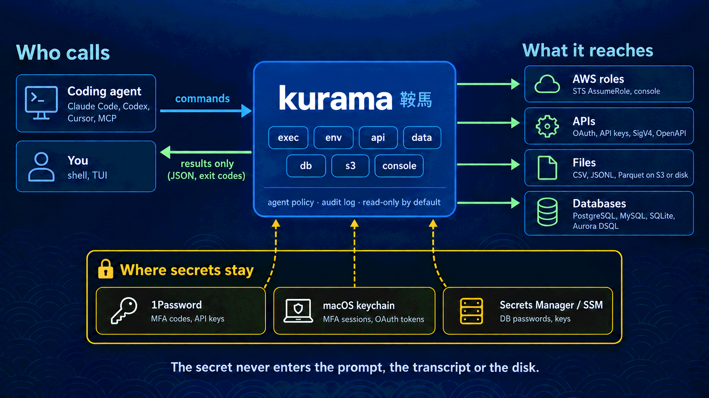
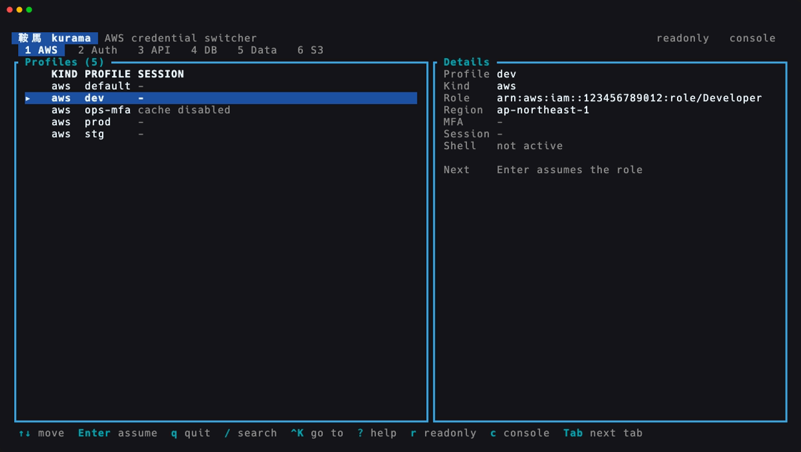
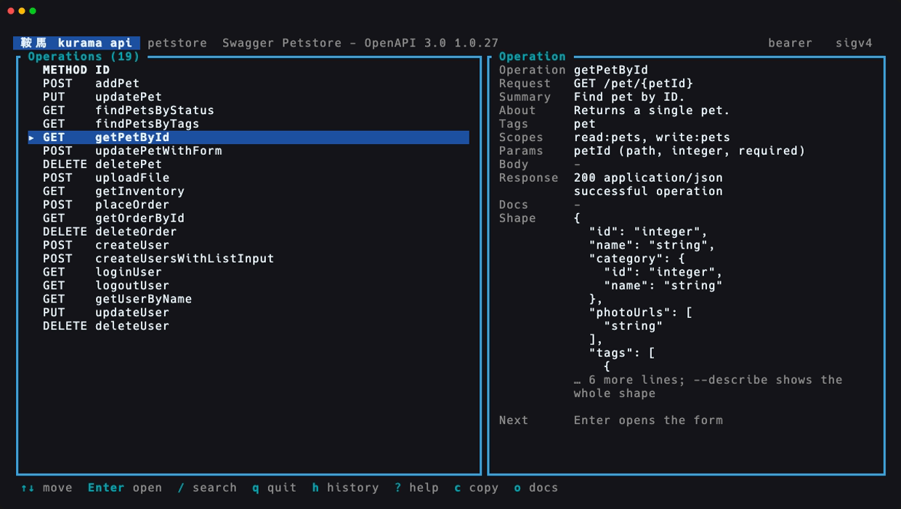
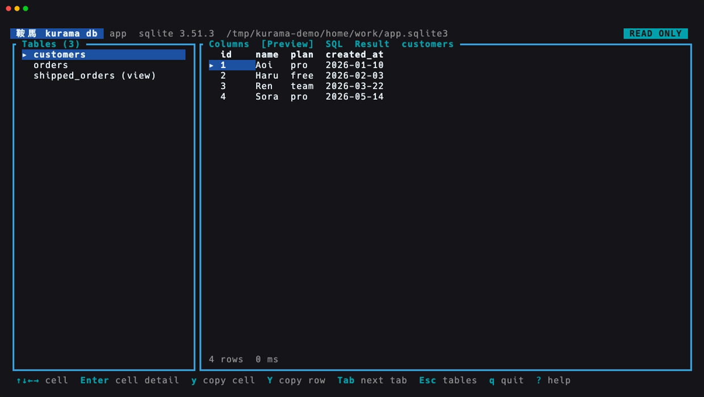

<p align="center">
  
</p>

<p align="center"><strong>English</strong> · <a href="README.ja.md">日本語</a></p>

<h1 align="center">鞍馬 Kurama</h1>

<p align="center">
  <strong>Credentials and APIs for you and your coding agents.</strong><br>
  Let an agent use your AWS roles, APIs and data without ever handing it a secret.
</p>

<p align="center">
  <a href="https://github.com/ynishimura/kurama/actions/workflows/pr.yml"></a>
  <a href="https://scorecard.dev/viewer/?uri=github.com/ynishimura/kurama"></a>
  <a href="https://www.bestpractices.dev/projects/15111"></a>
  <a href="Cargo.toml"></a>
  <a href="#requirements"></a>
  <a href="LICENSE"></a>
</p>

<p align="center">
  <a href="#built-for-coding-agents">機 For agents</a> ·
  <a href="#quick-start">始 Quick start</a> ·
  <a href="#features">技 Features</a> ·
  <a href="#usage">用 Usage</a> ·
  <a href="#configuration">設 Configuration</a> ·
  <a href="#the-kurama-vision">志 Vision</a> ·
  <a href="#development">和 Contributing</a>
</p>

---

**Kurama** is the credential layer between a coding agent (Claude Code,
Codex, Cursor or your own) and the things it needs to reach: AWS roles behind
MFA, APIs behind OAuth or API keys, files on S3, and databases behind a
bastion. The agent runs `kurama exec`, `kurama api`, `kurama data` or
`kurama db`. kurama does the rest: it fetches the MFA code from 1Password,
assumes the role, reads the key from its secret store, signs the request, and
hands back only the result. The secret never enters the prompt, the
transcript or the disk.

<p align="center">
  
</p>

The same commands work for a person at a terminal. Switch AWS roles in your
shell, open the AWS console, explore an API's OpenAPI description in a TUI,
and query files and databases without assembling a connection string.

```sh
kurama                            # Explore profiles in the TUI
kurama env dev                    # Switch your current shell to dev
kurama exec prod --readonly -- aws s3 ls
kurama console dev                # Open the AWS console
kurama login github               # OAuth: authorize in the browser, store the token
kurama api github /user --jq .login
kurama api github                 # Explore the API's OpenAPI description in the TUI
kurama api github issues/create -P owner=o -P repo=r -d '{"title":"x"}'
kurama preset setup openai --set secret=op://Agent/openai/credential # an API in one command
kurama data ./events.jsonl --query 'SELECT count(*) FROM data'
kurama db app --tables
```

<p align="center">
  
</p>

## Built for coding agents

An agent should not need to read your AWS keys or API tokens to do its work,
and it should not have to guess how a CLI works. kurama is built around both:

| An agent needs | kurama gives it |
| --- | --- |
| To call an API without seeing its key | `kurama api <API> <path or operation>` reads the credential from 1Password, Secrets Manager or Parameter Store and adds it to the request. Only the response comes back. |
| To run a tool with AWS credentials | `kurama exec <profile> -- <command>` puts role credentials in that command's environment only. They never go to a file or to stdout. |
| To learn the commands before running one | `kurama agent` prints the contract of the installed version: commands, JSON fields, exit codes, and how to add a source. `kurama agent --json` prints the same as one catalog. |
| To learn an API before calling it | `kurama api <API> --schema` prints one JSON contract covering every operation. `--skill` turns it into an Agent Skill (`SKILL.md`). |
| To know what a call will do | `--dry-run --json` prints the request, with every credential masked, and each effect the run would have: an API request, a 1Password read, an STS call, a browser launch. |
| To recover from a failure | With `--json` or `--jq`, a failure is one JSON document on stderr with `code`, `category`, `exit_code`, `message`, `hint`, `retry` and `next_actions`. |
| To know when to stop and ask | Exit code 3 means a person has to act (approve a login, unlock 1Password), and the error names the command to give them. Without a terminal, nothing ever waits on a prompt. |
| To run unattended | A 1Password service account token, read from the keychain, supplies MFA codes and secrets without a prompt. One cached MFA session serves every role behind it. |

Give your agent the contract once:

```bash
kurama agent install   # ~/.claude/skills/kurama/SKILL.md, and one Skill per API
                       # generated from its description (kurama-api-<name>/SKILL.md)
```

Then ask it in plain words, such as "list my open GitHub issues" or "how many
rows are in last month's orders on S3", and it runs kurama:

```bash
kurama api github issues/list-for-authenticated-user -P state=open --jq '.[].title'
kurama data 's3://my-bucket/orders/2026-08.parquet' --aws-profile ops --query 'SELECT count(*) FROM data' --json
```

A person gets the same sources in a TUI: tabs on the home screen, `Ctrl-K`
to jump to any source, and an explorer for each API, database and bucket.

<p align="center">
  
</p>

<p align="center">
  
</p>

## Features

<table>
  <tr>
    <td width="50%"><strong>Browse, search, switch</strong><br>Find a profile in the TUI, see its session state, and press Enter to use it.</td>
    <td width="50%"><strong>MFA with less repetition</strong><br>Get codes from 1Password and reuse MFA sessions through the macOS Keychain.</td>
  </tr>
  <tr>
    <td><strong>Your shell, ready to work</strong><br>Export temporary credentials into zsh, with profile completion built in.</td>
    <td><strong>One command, one environment</strong><br>Use <code>exec</code> to give one command credentials and leave your current shell unchanged.</td>
  </tr>
  <tr>
    <td><strong>Read-only sessions and console access</strong><br>Attach the AWS <code>ReadOnlyAccess</code> policy or open a federated console session.</td>
    <td><strong>Scripts and agents welcome</strong><br>Structured JSON, predictable exit codes, stdout reserved for data, and <code>kurama agent</code>, the contract of the installed version.</td>
  </tr>
  <tr>
    <td><strong>OAuth sources</strong><br>Authorization code with PKCE, device code, or client credentials. Tokens refresh automatically and are stored in the Keychain.</td>
    <td><strong>An API client that knows your tokens</strong><br><code>kurama api</code> sends the bearer token, retries once after a 401, and filters JSON with <code>--jq</code>.</td>
  </tr>
  <tr>
    <td><strong>An OpenAPI explorer</strong><br>Point <code>openapi</code> at a description, then browse its operations, fill in a form, send the request, filter the result with jq, and copy the command that repeats the call.</td>
    <td><strong>Operations by name</strong><br><code>--ops</code> lists operations, <code>--describe</code> shows an operation's parameters, body skeleton and response shape, and <code>kurama api &lt;API&gt; &lt;OP&gt; -P name=value</code> puts each parameter where it belongs.</td>
  </tr>
  <tr>
    <td><strong>API keys where the API wants them</strong><br>The key is read from 1Password or AWS on every call and never stored. It is sent as a bearer token, in a named header, over HTTP Basic or in a query parameter.</td>
    <td><strong>Presets for common APIs</strong><br><code>kurama preset setup</code> writes the config sections for GitHub, Google, Linear, OpenAI, Slack, Jira, Zendesk, Backlog and more. The sections are written out in full, so the file shows where each credential goes.</td>
  </tr>
  <tr>
    <td><strong>Files, locally or on S3</strong><br><code>kurama data</code> runs read-only SQL over CSV, JSONL and Parquet with embedded DuckDB, within row and byte limits.</td>
    <td><strong>Databases, read-only by default</strong><br><code>kurama db</code> reads SQLite, PostgreSQL, MySQL and Aurora DSQL, through an SSM bastion or with IAM authentication. Writing takes two explicit opt-ins.</td>
  </tr>
</table>

## Quick start

Install kurama, enable the shell integration, then pick an existing AWS role
profile. The examples below use a profile named `dev`. To start with an API
instead, see [`kurama preset`](#configuration).

### Requirements

kurama targets macOS and zsh (the default macOS shell). The MFA session cache
and the OAuth token store live in the login keychain.

kurama also builds and runs on Linux (`x86_64` and `aarch64`, glibc). Linux
has no keychain, so MFA sessions and OAuth tokens are fetched again on every
run, and the 1Password service account token must come from
`OP_SERVICE_ACCOUNT_TOKEN`. The Linux build has not yet been verified by a
recorded run; the tests run on macOS. Windows and musl targets are not
supported: the build stops with a message naming the target.

- AWS role profiles in `~/.aws/config`, with access to their source credentials
- [1Password CLI](https://developer.1password.com/docs/cli/) (`op`) for profiles
  that require MFA and for `op://` secrets; the item is set up in
  [Configuration](#configuration)

### Installation

Each release publishes prebuilt binaries for macOS (Apple silicon and
Intel) and Linux (x86_64 and arm64):

```bash
brew install ynishimura/tap/kurama
# or, without Homebrew, into ~/.cargo/bin:
curl --proto '=https' --tlsv1.2 -LsSf https://github.com/ynishimura/kurama/releases/latest/download/kurama-installer.sh | sh
```

To build from source, you need the Rust toolchain from
[rustup](https://rustup.rs) (1.95.0 or newer) and `~/.cargo/bin` on `PATH`:

```bash
git clone https://github.com/ynishimura/kurama.git
cd kurama
cargo xtask install-signed        # -> ~/.cargo/bin/kurama
```

`install-signed` builds the binary, signs it with a stable local identity and
installs it. It then asks once for your login keychain password, so that this
build can read the keychain entries kurama uses. After that, a rebuild does
not bring the dialog back. `docs/development/setup.md` covers the one-time
certificate setup. `cargo install --locked --path .` also works, but it
replaces the signature, so the keychain asks again.

Then add one line to `~/.zshrc`, after `compinit`:

```zsh
eval "$(kurama init zsh)"
```

This defines a `kurama` shell function, so exported credentials land in the
current shell, and registers tab completion. Open a new shell and check:

```bash
kurama --version
whence -w kurama   # kurama: function
```

Tab completion covers:

- credential source names for `env`, `exec`, `login`, `logout` and `status`
- AWS profile names for `console` and auth source names for `token`
- API names and operation IDs for `api` and `--describe`

Each candidate comes with a description. For an operation, `-P` offers
`name=` with no trailing space, required parameters first, and skips names
already given. After `=`, it completes enum values, booleans, defaults and
examples from the description.

`--jq` completes response fields from the API's `openapi` description,
including paths such as `.content[].name` and quoted expressions such as
`'.content[] | select(.na'`. The word stays open, so you can keep typing an
unfinished quoted expression. For a plain path, the response is the one for
the `-X` method, or for POST when `-d` is given and GET otherwise. With
`--json`, fields are placed under `.body`. This needs `openapi` on the API
profile. An empty schema, or one that is only a dictionary, has no
candidates. Response schemas are followed to depth 6, and only the first
`oneOf` / `anyOf` branch is used. Candidates follow the schema even when the
actual response differs, and transformed output such as `map({a: .x}) | .[0].`
is not inferred.

Completion reads the configuration and local or cached OpenAPI files, so a
description at a URL that has not been cached yet has no operation
candidates. Completion never authenticates, fetches a description, or changes
the cache.

The completer calls the binary that printed the script by its absolute path,
bypassing the shell wrapper. Re-run the `eval` line when you switch binaries.
`kurama init zsh --completion-only` prints only the completion script, for setups that
manage `fpath` themselves.

### Make your first switch

```bash
kurama status                # See the profiles available in ~/.aws/config
kurama env dev               # Export temporary credentials into this shell
kurama unset                 # Clear the credentials when you are done
```

Prefer a profile picker? Run `kurama` in a terminal. In scripts and agents,
start with `kurama exec dev -- <command>`.

For an API and Claude Code, one command takes a preset from nothing to a
first answer -- the sections, a check, the credential, kurama's Skill for
Claude Code and one read -- and says what to run next wherever it stops:

```bash
kurama preset setup github --set secret=op://Agent/kurama-github/credential
```

Then `kurama agent` prints the recipes an agent can follow, such as finding
why an AWS Lambda function fails from its logs and the repository's recent
changes, read only.

<details>
<summary><strong>Updating and uninstalling</strong></summary>

### Updating

```bash
brew upgrade kurama                          # a Homebrew install
cd kurama && git pull && cargo xtask install-signed   # a build from source
```

To update a shell-installer install, run the installer again. Then open a new
shell (or re-run the `eval` line) so the wrapper and completions come from
the new binary. A new binary may ask for keychain access once per entry; see
[Keychain prompts](#mfa-session-cache).

Grant that first access from a terminal. macOS grants keychain access per
binary signature, and without a terminal there is no prompt to approve. In
that case the read fails with
`macOS denied this build access to the keychain entry`, `kurama status`
reports the session as `unreadable`, and `env` / `exec` get a fresh MFA
session instead of reusing the cached one. One approval in a terminal fixes
this.

### Uninstalling

```bash
kurama logout --all      # optional: remove cached MFA sessions and OAuth tokens from the keychain
brew uninstall kurama    # or: cargo uninstall kurama, or rm ~/.cargo/bin/kurama
```

Then remove the `eval "$(kurama init zsh)"` line from `~/.zshrc`. Your
configuration stays in `~/.config/kurama/`.

</details>
## Usage

```bash
kurama                       # TUI: pick a profile (needs a terminal)

kurama env dev               # assume the role and export the credentials into this shell
kurama env prod --readonly   # attach the ReadOnlyAccess policy to the session
kurama env dev --json        # credential_process JSON on stdout, no shell changes
kurama exec dev -- aws s3 ls  # run one command with the credentials; this shell is unchanged
kurama console prod          # assume the role and open the AWS console

kurama login ops             # get and cache an MFA session now (no-op while one is valid)
kurama login ops --force     # replace the cached session
kurama status                # profiles, sources and APIs with their state; * marks what this shell holds
kurama status --json         # the same as one JSON array
kurama config check          # every problem in config.toml at once; no secret store, keychain or network
kurama config show auth.github   # the saved values, literal secrets redacted (list, path: sections, the file)
kurama config add --file new.toml   # append sections, checked whole first; --dry-run writes nothing
kurama config set core.log_level '"debug"'   # change one key in place; set --file replaces whole sections
kurama config remove api.old   # remove sections (unset removes keys); an [auth.*] an API still uses is refused
kurama preset                # the bundled provider presets (GitHub, Google, Linear, ElevenLabs, OpenAI, Slack, Contentful, Fireworks, Jira, Zendesk, Backlog); reads no configuration
kurama preset setup github --set secret=op://Agent/kurama-github/credential --dry-run  # its TOML, checked with the file; nothing written or sent
kurama preset setup github --set secret=op://Agent/kurama-github/credential  # add (or keep), check, credential, Claude Code Skill, first read; resumable
kurama logout ops            # remove the cached MFA session of the profile's MFA device
kurama logout --all          # remove every cached MFA session and stored token

kurama login github          # OAuth source: run the grant and store the token (no-op while valid)
kurama login github --no-browser   # print the authorization URL instead of opening the browser
kurama token github          # print the access token (refreshed when needed)
kurama token github --fingerprint   # sha256:<hex> of the token: same value or not, without printing it
kurama api github /user --jq .login          # one request with the bearer token
kurama api github "POST /repos/o/r/issues" -d '{"title":"x"}' --json
kurama api apigw-dev /items                  # SigV4-signed with the aws_profile's role credentials
kurama api github            # the OpenAPI explorer (needs openapi under [api.github])
kurama api github --ops issues               # operations of the description matching "issues"
kurama api github --describe issues/create   # parameters, request/response shapes, scopes, example command
kurama api github --schema issues/create     # the JSON contract an agent builds calls from
kurama api github --skill                    # an Agent Skill (SKILL.md) for the API
kurama api github issues/create -P owner=o -P repo=r -d '{"title":"x"}'
kurama api github --refresh-spec             # fetch the description again
kurama env github            # export the token into its env_var (GITHUB_TOKEN)
kurama exec github -- gh api /user

kurama unset                 # remove the variables kurama exported from this shell

kurama agent                 # the contract for agents and scripts (docs/agents/kurama/, embedded)
kurama agent --skill         # an Agent Skill that tells an agent to read it first
kurama agent install         # write it and one Skill per API under ~/.claude/skills
kurama agent --json          # every subcommand, argument and exit code as one JSON catalog
```

For agents and scripts, the [automation guide](docs/agents/kurama/) covers
the commands, JSON fields and exit codes on one page. It also shows how to add
an `[auth.*]` source or an `[api.*]` profile. `kurama agent` prints the same
page from the installed binary, so an agent on any machine reads the contract
of the version it actually runs. Two variants go with it:

- `kurama agent --json` prints every subcommand, its arguments and the exit
  codes as one JSON document, read from the binary's own definition.
- `kurama agent --skill` prints an Agent Skill (`SKILL.md`) that tells an
  agent to read the guide first.

To install the Skills where Claude Code finds them:

```bash
kurama agent install    # kurama/SKILL.md and kurama-api-<name>/SKILL.md under ~/.claude/skills
```

`agent install` writes a file only when its content changed and leaves every
other directory alone. It skips an API that has no description and says why.
It also takes `--dir DIR`, `--offline` (cached descriptions only), `--dry-run`
and `--json`.

<details>
<summary><strong>Shell exports and command isolation</strong></summary>

For an AWS profile, `kurama env` exports `AWS_ACCESS_KEY_ID`,
`AWS_SECRET_ACCESS_KEY`, `AWS_SESSION_TOKEN`, `AWS_SESSION_EXPIRATION`,
`AWS_REGION` and `AWS_DEFAULT_REGION`. It also sets `KURAMA_AWS` to the
profile name, and `AWS_READONLY_SESSION` in read-only mode. Without the shell
integration, `eval "$(command kurama env dev)"` does the same.

Each switch first unsets stale credential and profile variables, including
the legacy `AWS_CREDENTIAL_EXPIRATION` and `AWS_DEFAULT_PROFILE`.
`AWS_CA_BUNDLE` is kept, because it controls TLS.

For an `[auth.*]` source, `kurama env` exports the token into the source's
`env_var` -- or, for a `kind = "secrets"` source, each secret into its own
variable. It also sets `KURAMA_AUTH` to the source name and `KURAMA_AUTH_VAR`
to the variables' names, space separated. That way `kurama unset` can still
clear them after the configuration renames or removes a variable.

`kurama exec` sets the same variables for one command only, then replaces
itself with that command. The exit code and signals are the command's own.

</details>

### Exit codes and error output

A failure prints one `error[CODE]: message` line on stderr, sometimes
followed by a `hint:` line.

| Exit code | Meaning |
| --- | --- |
| `0` | Success |
| `1` | Tool error (a network failure, a jq error) |
| `2` | Usage: an unknown profile or API, invalid configuration, a verb the source's kind does not support, no terminal for the TUI, or a command `exec` cannot start. A bad argument prints clap's usage text without an `error[CODE]` line, unless the subcommand reports usage errors itself (`usage_error` in `kurama agent --json`) |
| `3` | A person must act; follow the hint (`kurama login <source>` in a terminal, `op signin`, unlock the keychain) |
| `4` | The remote side rejected the request: AWS, an authorization server, or an HTTP status outside 2xx |

`exec` returns the launched command's own exit code. Set
`KURAMA_LOG_FORMAT=json` to get one JSON log object per line on stderr.
stdout carries only data: the export script, JSON, the status table, or the
output of the command run by `exec`.

### Interactive TUI Mode

`kurama` without a command opens the home screen. It shows:

- a header with the mode badges;
- the profile table: the kind, the MFA session state (as in
  `kurama status`), and a `*` on the profile this shell holds;
- a detail pane for the selected profile, on terminals at least 100 columns
  wide;
- one row of key hints.

Enter exports the selected profile, like `kurama env`. When no MFA provider
is configured, a dialog asks for the MFA code. The header also shows how long
the selected profile's MFA session has left, with a warning under 15 minutes.

Tabs under the header switch between AWS, Auth, API, DB, Data and S3 (keys
`1`-`6`, or `Tab`). Each tab shows the rows and details `kurama status`
reports, and switching tabs calls nothing. Enter acts on the selected row:

- on an Auth source, it runs `kurama login`;
- on an API, a database or an S3 connection, it opens that explorer, and
  quitting the explorer returns to the tab;
- on a Data workspace, it copies `kurama data <workspace> --tables`.

Set `NO_COLOR=1` to use the home screen and the explorers without colors.
Selections and enabled badges stay bold. An empty `NO_COLOR` keeps the normal
palette. With `TERM=dumb`, or in a `KURAMA_AGENT` run, every TUI entry point
exits 2 with a hint before it takes over the terminal. In that environment,
use `kurama status`, `kurama env <profile>`, `kurama api <API> --ops` or
`kurama db <DB> --tables` instead.

<p align="center">
  
</p>

The screens use 24-bit color from a traditional Japanese palette: lapis
(ruri) for the title and the selection, dayflower blue (tsuyukusa) frames,
pale green-blue (asagi) keys and titles, and young bamboo, kerria and crimson
for states.

| Key | Action |
| --- | --- |
| <kbd>↑</kbd> <kbd>↓</kbd> / <kbd>j</kbd> <kbd>k</kbd> | Move; <kbd>Home</kbd> <kbd>End</kbd> <kbd>PgUp</kbd> <kbd>PgDn</kbd> jump |
| <kbd>/</kbd> | Search profiles; type to filter, Backspace to edit, Esc to clear |
| <kbd>1</kbd>-<kbd>6</kbd> / <kbd>Tab</kbd> | Switch to the AWS, Auth, API, DB, Data or S3 tab |
| <kbd>Ctrl-K</kbd> / <kbd>:</kbd> | Go to any profile, source, API, operation, database or bucket |
| <kbd>Enter</kbd> | Assume the selected role |
| <kbd>r</kbd> | Toggle read-only mode |
| <kbd>c</kbd> | Toggle console launch |
| <kbd>?</kbd> / <kbd>F1</kbd> | Show help |
| <kbd>q</kbd> / <kbd>Ctrl-C</kbd> | Quit |

## Configuration

kurama reads `~/.config/kurama/config.toml`; set `KURAMA_CONFIG_PATH` to use
another file. Every key is optional. The file has these sections:

- `[core]`: settings that do not depend on a provider;
- `[aws]`: AWS settings;
- `[onepassword]`: the 1Password CLI;
- `[auth.<name>]`: credential sources that are not AWS profiles, such as
  OAuth clients and API keys issued elsewhere;
- `[api.<name>]`: the APIs those sources are used with.

An unknown key stops kurama with `error[CONFIG_INVALID]`, naming the key and
its line. A `KURAMA_CONFIG_PATH` that points to a missing file fails the same
way. In both cases the hint names the file in use.

`kurama config check` (`--json` for agents and CI) lists every problem in one
run: one per section, each with its line and the code the failing command
would print. It also reports the file in use and what chose it, and the state
of each `openapi` description. It reads a local file or a URL's cached copy,
and fetches nothing. It exits 2 with `CONFIG_INVALID` when any problem is an
error.

The `config` subcommands also edit the file:

- `kurama config add --file FILE|-` appends new sections after the file's own
  bytes. Several sections that refer to each other can be added at once. It
  refuses a section the file already has, and a literal secret.
- `kurama config set PATH VALUE` changes one key inside a section. VALUE is a
  TOML value, and an array is replaced whole. `config set --file FILE|-`
  replaces whole sections, the ones the input names.
- `kurama config unset KEY...` removes keys, so their defaults apply.
- `kurama config remove SECTION...` removes sections. It refuses to remove an
  `[auth.*]` that a remaining API still uses, and it never removes an auth
  together with the API that used it.
- `kurama config show [PATH]` and `config list [SECTION]` print what is
  saved, with literal secrets redacted.

An edit changes only what it names: the other values, comments and order
stay. The whole result is checked once, before the single write. `--dry-run`
prints the changed lines, with literal secrets redacted, and writes nothing.
The file's mode and a symbolic link at its path are kept. A save that fails
is `CONFIG_WRITE_FAILED` (exit 1).

`kurama preset` lists the providers kurama ships sections for:

- GitHub, with a token or an OAuth app;
- Google Sheets, Docs and Drive;
- Linear, with an API key or an OAuth app;
- ElevenLabs, OpenAI and Fireworks, with an API key;
- Slack, with a bot token;
- Contentful, with a personal access token;
- Jira, with an API token over HTTP Basic;
- Zendesk, with an OAuth client credentials grant;
- Backlog, with an API key in the query string.

`kurama preset setup <ID> --set <key>=<value>...` takes one preset from
nothing to a first answer and reports each step as `done`, `planned`,
`needs_action`, `failed` or `skipped`, with the command to run next:

1. It appends the preset's sections through the same writer as `config add`.
   The TOML is expanded in full, with a comment naming the preset, so the
   file itself shows every URL a credential is sent to. The file's bytes and
   comments are kept, an `[auth.*]` the file already has is reused only when
   its contract matches the preset's (scopes it lacks are a warning and a
   step), `--as` renames the API and `--auth-as` the auth, and the result is
   checked whole before the one write. An `[api.*]` that is already there is
   kept as it is, so a second run resumes where the first stopped.
2. It reads config.toml back and says whether the credential can be used
   without a person (a login it needs is the next step).
3. It writes kurama's Agent Skill to `~/.claude/skills/kurama/SKILL.md`.
4. It sends the preset's example as one GET, held to the `[agent]` policy and
   audited like `kurama api`.

A failure keeps its usual code: a locked 1Password is `SECRET_UNAVAILABLE`, a
missing login `OAUTH_LOGIN_REQUIRED`, a rejected credential `API_HTTP_ERROR`.
`--dry-run` only plans and checks the sections and prints their TOML, writing
and sending nothing; `--offline` does everything but the read.

```toml
[core]
log_level = "info"             # kurama's own log level; RUST_LOG wins

[aws.session_name]
# Role session name template. Placeholders: {prefix}, {profile}, {readonly}, {role}, {account}.
# {readonly} expands to readonly_indicator in readonly mode; otherwise it is
# removed together with one adjacent hyphen.
template = "{prefix}-{readonly}-{profile}"
prefix = "kurama"
readonly_indicator = "ro"

[aws.session_cache]
enabled = true      # Reuse MFA-authenticated IAM-user sessions (default)
duration = 43200    # Seconds; 900..=129600, independent of role duration

[onepassword]
enabled = true
cli_path = "op"
# Item with access_key_id, secret_access_key and a one-time password field.
item_name = "my-aws-credentials"
# Optional: vault to search. Required when using a 1Password service
# account (OP_SERVICE_ACCOUNT_TOKEN); narrows the search otherwise.
vault = "Agent"
# Optional: seconds op may take when nobody is at the terminal (default 30).
# Reaching it fails (SECRET_UNAVAILABLE, or MFA_PROVIDER_FAILED for a TOTP
# code) instead of hanging. With a terminal the approval takes as long as the
# person needs. Must be at least 1.
timeout = 30
# Optional: macOS keychain service holding a 1Password service account token, read
# for the current user and passed to op as OP_SERVICE_ACCOUNT_TOKEN, so an
# unattended run never waits for a biometric prompt. A token already in the
# environment wins. Add one with:
#   security add-generic-password -a "$USER" -s OP_SERVICE_ACCOUNT_TOKEN -w
service_account_keychain = "OP_SERVICE_ACCOUNT_TOKEN"

[onepassword.mappings]
# Optional: a source_profile name or MFA serial ARN selects another item.
work = "work-aws"

[auth.github]                  # an OAuth 2.0 source; the name must not be an AWS profile name
kind = "oauth"                 # optional: the default
grant_type = "authorization_code"   # or device_code, client_credentials
auth_url = "https://github.com/login/oauth/authorize"
token_url = "https://github.com/login/oauth/access_token"
client_id = "Iv1.xxxxxxxx"
client_secret = "op://Agent/GitHub OAuth App/client_secret"   # op://, aws-secrets://, aws-ssm:// or a literal
scopes = ["repo", "read:user"]
env_var = "GITHUB_TOKEN"       # kurama env / exec put the token here; default KURAMA_TOKEN
# redirect_port = 8080         # fixed loopback port; default: an ephemeral port

[auth.google]
kind = "oauth"
grant_type = "device_code"
issuer = "https://accounts.google.com"   # endpoints from OpenID Connect discovery
client_id = "..."
scopes = ["openid", "email"]

[auth.elevenlabs]              # an API key issued elsewhere: no grant, nothing cached
kind = "token"
token = "op://Agent/ElevenLabs/api-key"   # a reference only; a literal is refused
header = "xi-api-key"          # default Authorization
format = "{token}"             # default "Bearer {token}"; {token} is the only placeholder
env_var = "ELEVENLABS_API_KEY" # kurama env / exec put the credential here; default KURAMA_TOKEN

[auth.jira]
kind = "token"
token = "op://Agent/kurama-jira/credential"
username = "me@example.com"    # instead of header/format: HTTP Basic, the credential as the password

[auth.backlog]
kind = "token"
token = "op://Agent/kurama-backlog/credential"
query = "apiKey"               # instead of header/format/username: the credential in this query parameter;
                               # an error message names the URL without its query

[auth.example-login]           # values for the environment of `kurama exec`: no request, no grant, nothing cached
kind = "secrets"
[auth.example-login.env]       # VARIABLE = reference; a literal, AWS_* and KURAMA_* are refused
SITE_USER = "op://Agent/<item-id>/username"
SITE_PASS = "op://Agent/<item-id>/password"
SITE_OTP = "op://Agent/<item-id>/one-time password?attribute=otp"

[api.github]
description = "GitHub REST API"
base_url = "https://api.github.com"
auth = "github"                # default: the [auth.*] with the same name, else no authentication
openapi = "https://raw.githubusercontent.com/github/rest-api-description/main/descriptions/api.github.com/api.github.com.json"
headers = { Accept = "application/vnd.github+json", "X-GitHub-Api-Version" = "2022-11-28" }
                               # sent with every request, the explorer's too; -H replaces one of the same name.
                               # Authorization and other credential headers are CONFIG_INVALID, and so is a
                               # value that is not printable ASCII on one line

[api.internal]
base_url = "https://api.example.com"
openapi = "~/specs/internal-swagger.yaml"   # a local file (absolute or ~): OpenAPI 3.x or Swagger 2.0, JSON or YAML
# openapi = "https://api.example.com/openapi.json"
# openapi_auth = true          # fetch the URL with the API's own credential; it must be on the origin of base_url
auth = "google"                # a source with a different name than the API

[api.apigw-dev]                # an AWS API: requests are SigV4-signed with the profile's role credentials
description = "Member API dev"
base_url = "https://abc123.execute-api.ap-northeast-1.amazonaws.com/prod"
aws_profile = "dev"            # exclusive with auth
# service = "execute-api"      # only when the host does not name them (a custom domain);
# region = "ap-northeast-1"    # --service / --region on the command line win
```

The role session duration comes from `duration_seconds` in `~/.aws/config`
(3600 seconds when absent). Read-only mode attaches
`arn:aws:iam::aws:policy/ReadOnlyAccess`.

`issuer` excludes explicit `auth_url` / `token_url` / `device_auth_url`, and
`auth` excludes `aws_profile`. Each of these URLs, and each endpoint a
discovery document names, must use `https://`. `http://` is accepted only for
`localhost` or a loopback address, because otherwise the grant credentials
(client secret, code, refresh token, device code) would cross the network in
the clear. `kind` decides which keys a source takes; a key that belongs to
the other kind is refused with its line.

A `kind = "token"` source has no grant and no token store entry.
`kurama api` reads the reference on every call and sends the credential in
one of three ways: in `header` (shaped by `format`), over HTTP Basic with
`username`, or in the `query` parameter. It does not retry after a 401. For
such a source:

- `kurama token` prints the value;
- `kurama env` and `kurama exec` put it in `env_var`;
- `kurama login` and `kurama logout` have nothing to do;
- `kurama status` reports it as `not_checked`, because it resolves no secret.

A `kind = "secrets"` source is for a command that needs several secrets in
its environment, such as a browser automation tool getting past a login
screen. Every reference under `env` is read when `kurama exec` or
`kurama env` runs, and the command starts only after all of them were read;
the first that cannot be read fails the run with its `SECRET_*` code. Fields
of one 1Password item are one `op` call, and an `?attribute=otp` reference
is read fresh for each run. For such a source:

- `kurama exec <source> -- <cmd>` runs `<cmd>` with every variable set, and
  `kurama env` exports them into the shell;
- `kurama token`, `console` and `--readonly` are refused (`KIND_UNSUPPORTED`),
  and an `[api.*]` cannot use it as `auth` (`CONFIG_INVALID`);
- `kurama login` and `kurama logout` have nothing to do;
- `kurama status` lists its variable names, never a value, as `not_checked`.

The environment of a command is not a boundary: a command an agent runs can
print what it was given. What kurama keeps out is the transcript, the shell
history and every file.

### Guardrails for agents (`[agent]`)

A run whose environment sets `KURAMA_AGENT` to anything but empty or `0` is
an agent run; set it, for example, in the agent's own settings. An agent run
is held to the `[agent]` policy; a person's run never is. A refused call ends
with `error[AGENT_POLICY_DENIED]` (exit code 3) before any credential is read.
The person can let it through with `--confirm`.

An agent run is also non-interactive, whatever its streams are. This matters
for an agent whose harness gives it a pseudo terminal: no TUI opens, stdout
gets the same bytes a pipe would, and progress never rewrites a line. Logins
and 1Password prompts are not affected.

```toml
[agent]
allow_methods = ["GET", "HEAD"]  # the default: what `kurama api` may send
allow_paths = []                 # empty: every path; `*` is any run of characters
deny_paths = ["/admin*"]         # matched against the URL path, never the query
exec_readonly = true             # the default: `exec` on an AWS profile attaches ReadOnlyAccess

[api.github]
base_url = "https://api.github.com"

[api.github.agent]               # each key named replaces the [agent] one for this API
allow_methods = ["GET", "POST"]
```

In an agent run, `db --execute --commit` needs `--confirm` whatever
`allow_write` says. `--rollback` and every `--dry-run` need nothing.

### Audit log (`kurama audit`)

By default, each `api`, `exec`, `db` and `data` call of an agent run is
appended to `~/.local/state/kurama/audit.jsonl` (mode 600). `[audit] enabled`
changes that, as shown below. An entry records:

- the time, the command, and the API, source, database or workspace;
- the method and path (never the query);
- the status, the exit code and the duration;
- whether an agent ran it;
- `exec`'s program (never its arguments);
- the SHA-256 of the SQL for `db` and `data`.

No secret, header or body is written. `kurama audit [--since 12h] [--json]`
lists the log. If the log cannot be written, kurama prints one warning; the
call itself does not fail.

```toml
[audit]
enabled = true         # every run; false: none; absent: KURAMA_AGENT runs only
max_bytes = 1048576    # the default: past it the log moves to audit.jsonl.1
```

### MCP server (`kurama mcp`)

`kurama mcp` serves kurama to an MCP client over stdio. It offers these
tools: `ready`, `list_apis`, `list_operations`, `describe_operation`,
`call_api`, `query_data` and `query_db` (read only). Each tool runs one of
kurama's own JSON commands with `KURAMA_AGENT=1`. So every call is held to the
`[agent]` policy above and recorded in the audit log. A failure returns the
same JSON error document, including the `next_actions` for a person to run.
Nothing prompts, and there is no `--confirm` over MCP. `[mcp] tools` names
a subset of the tools and `[mcp] call_timeout` (600 seconds by default)
bounds each call, over stdio and HTTP alike; the configuration is read at
start, so an invalid one stops `kurama mcp` with `CONFIG_INVALID`. To
register it with Claude Code:

```bash
claude mcp add kurama -- kurama mcp
```

#### Remote MCP clients (`kurama mcp --listen`)

An agent that runs in the cloud cannot start `kurama mcp` on your Mac.
`kurama mcp --listen` serves the same tools over MCP Streamable HTTP on a
loopback address, and Tailscale Funnel gives it an HTTPS URL. Every request
carries a fixed token, kept in a secret store:

```toml
# ~/.config/kurama/remote.toml, named by KURAMA_CONFIG_PATH
[mcp]
listen = "127.0.0.1:8807"
token = "op://Agent/kurama-mcp-token/credential"
tools = ["list_operations", "describe_operation", "call_api"]
call_timeout = 25

[api.example]          # only the APIs the agent may reach
base_url = "https://api.example.com"

[api.example.agent]
allow_paths = ["/v1/items*"]
```

```bash
KURAMA_CONFIG_PATH=~/.config/kurama/remote.toml kurama mcp --listen
tailscale funnel --bg 8807     # https://<machine>.<tailnet>.ts.net/mcp
```

Funnel needs HTTPS certificates enabled for the tailnet and the `funnel`
nodeAttr in its policy file; it serves on 443 (or 8443 / 10000).

| Client | Works | How the token is passed |
| --- | --- | --- |
| ElevenLabs Agents | yes | the MCP server's secret token (a workspace member accepts the MCP Server Terms first) |
| xAI API (Grok) | yes | `authorization` of Remote MCP Tools |
| Claude API | yes | `authorization_token` of the MCP connector |
| OpenAI API | yes | `authorization` of the remote MCP tool |
| claude.ai | conditionally | a custom connector with "No sign-in" and an `Authorization: Bearer <token>` request header (a beta some organizations see) |
| ChatGPT | no | it offers OAuth or nothing, no fixed header |

kurama does not tell callers apart: keep the agent to yourself (no phone
number, widget or sharing), and expose only APIs whose responses may reach
the service hosting it.

#### Obsidian vault (`kurama obsidian`)

With an `[obsidian]` section, kurama reads an Obsidian vault through the
official Obsidian CLI (Obsidian 1.12.7+, Settings > General > Command line
interface), and `kurama mcp` adds the `obsidian_search`, `obsidian_read` and
`obsidian_files` tools. Only the folders `allow_paths` names are searched and
read; nothing is ever written, and no CLI command but `search:context`,
`read` and `files` runs. Obsidian has to be running.

```toml
[obsidian]
vault = "obsidian-brain"
allow_paths = ["Wiki/", "Daily/"]
cli_path = "/Applications/Obsidian.app/Contents/MacOS/obsidian"  # default "obsidian"
max_read_bytes = 65536   # a longer note is cut and says so
timeout = 20             # seconds per CLI call
```

```bash
kurama obsidian search "kurama" --path Wiki --json   # {"matches": [{"path", "line", "text"}]}
kurama obsidian read Wiki/kurama.md --json           # {"path", "content", "truncated"}
kurama obsidian files Daily                          # one path per line
```

A path that is absolute, holds `..` or lies outside `allow_paths` is
`OBSIDIAN_PATH_REFUSED` before the CLI runs. A note read over `--listen`
stays in the logs of the service hosting the client, as every tool result
does: name only the folders that may go there.

### Secret references

These keys hold secrets: `[auth.*] client_secret`, `[auth.*] token`,
`[db.*] username` and `[db.*] password`. Each one is written as a reference
to where the secret is kept, rather than the value itself:

```
op://<vault>/<item>/<field>
aws-secrets://<aws-profile>/<secret-id>[?region=<region>][#<json-key>]
aws-ssm://<aws-profile>/<parameter-name>[?region=<region>]
```

`op://` goes through the 1Password CLI. The two AWS forms read Secrets
Manager and Parameter Store with the role of an AWS profile, through the same
AssumeRole path as `kurama env`. Within one run, a tunnel, an IAM token and
every reference that name the same profile assume its role only once. A
`SecureString` is always decrypted.

`#<json-key>` takes one top-level string from a JSON `SecretString`, which is
the shape of an RDS managed secret. Reading two keys of it takes one
`GetSecretValue`. More generally, each secret is read once per process,
whichever store holds it. So two fields of one 1Password item take one
`op item get`, and one biometric prompt.

The region comes from the ARN first, then `?region=`, then the AWS profile.

A value shaped like `<scheme>://` whose scheme is none of the three is
refused with its line, so a misspelled scheme never passes as a literal
password. `[auth.*] client_secret` and `[db.*] username` also accept a
literal value; `[db.*] password` and `[auth.*] token` refuse one outright.

Nothing is resolved by `kurama status`, by `--dry-run` or by shell
completion. No resolved value is written to a file, a log or an error
message.
## OAuth sources and `kurama api`

`kurama login <source>` runs the source's grant and stores the token in the
login keychain under the service `kurama-token`. Each grant works
differently:

- `authorization_code` opens the browser and waits up to 5 minutes for the
  redirect on `127.0.0.1` (with PKCE).
- `device_code` shows a code and polls until you approve it.
- `client_credentials` needs no person and works without a terminal.

A stored token is reused while it is valid, and refreshed when a refresh
token came with it, so `login` usually has nothing to do. Without a
terminal, a grant that needs a person stops with exit code 3 and
`hint: run \`kurama login <source>\` in a terminal`.

`kurama api <API> <TARGET>` sends one request to `base_url` with the source's
bearer token. `TARGET` is a path (`/user`), a URL on the origin of
`base_url`, or `METHOD /path`. The token never goes to another host. `-X`,
`-H` and `-d` work like curl, and `-d` also takes `@file`, or `@-` for
stdin. `Accept` defaults to `application/json`, and so does `Content-Type`
when `-d` is given.

The response body goes to stdout. On a terminal, a JSON body is indented
for reading, keeping the values, key order and number notation the server
sent. In a pipe or a file you get the exact bytes, with nothing added.
`--json` prints `{"status", "headers", "body"}` instead. `--jq` runs a jq
filter on the body, or on that envelope with `--json`; the filter runs in
process, through [jaq](https://github.com/01mf02/jaq).

A 401 on a bearer token fetches a new token and retries once. A status
outside 2xx is `error[API_HTTP_ERROR]` with exit code 4. With
`--json` or `--jq`, a failure of `api`, `status`, `env` or `token` is
reported as one JSON error document on stderr instead of the `error[CODE]`
and `hint:` lines. It has the fields `code`, `category`, `exit_code`,
`message`, `hint`, `retry` and `next_actions`, the same document `data` and
`db` print. For an HTTP error, the envelope still goes to stdout.

`--output PATH` (`-o`) writes a 2xx body to PATH, byte for byte, and leaves
stdout empty. The body goes to a temporary file in the same directory, which
is renamed over PATH only once the whole body is written. An HTTP error, a
timeout or a lost connection therefore leaves an existing file untouched.
PATH is replaced, not written through: a symlink or hard link there is not
followed, and the new file has mode 600. A read-only file or a directory at
PATH is refused before the request is sent. `--output -` means stdout.
Other rules:

- `--output PATH` with `--json` or `--jq` is refused (`API_ARGUMENT_INVALID`,
  exit 2), except in a dry run, which writes nothing and lists the write in
  its plan.
- A file that cannot be written is `error[API_OUTPUT_FAILED]` (exit 1).

`--pages N` fetches up to N pages instead of one. It follows the `Link`
header's `rel="next"`, or, with `--cursor PATH=PARAM`, takes the value at
PATH in the JSON body and sends it as the query parameter PARAM. Each page
is printed as one line on stdout as soon as it arrives: its body as JSON,
its `--json` envelope, or its `--jq` results. The last line on stderr says
why paging stopped:

- `limit`: N pages were fetched (the line includes the URL the last page
  pointed to).
- `last`: a page named no next page.
- `unsupported`: the first page had no marker to follow, or the next page
  repeated one already fetched.
- `refused`: the next page is off the API's origin.

With `--json` / `--jq` that line is a JSON document. kurama does not read
flags such as `has_more`, so an API that keeps its cursor on the last page
costs one extra request. `--pages` takes a GET only and cannot be combined
with `--output`. A page that fails reports the same error a single request
would, prefixed with `page N:`; the pages before it are already on stdout.

`--dry-run` prints the request with credentials masked. It sends nothing
and starts no credential source. `--dry-run --json` prints the plan
instead: the resolved request with masked headers, the auth mode, where the
OpenAPI description came from and whether loading it used the network, and
the effects the run would have (API request, token store, authorization
server, browser, 1Password, STS). Headers are masked by their known
credential names.

The remaining options are `--timeout` (default 60 seconds), `-v` and `-k`.
`-k` skips certificate checks for the API request only; the authorization
server is always verified. `-v` also prints one line each time a secret is
read from its store, never the value, for example
`< secret read: ssm:GetParameter <id> (<region>)`,
`secretsmanager:GetSecretValue ...` or
`op item get <item> --vault <vault>`. A secret already read in the same
process prints nothing. `kurama token`, `env`, `exec` and `login` take the
same `-v` for the secrets of an `[auth.*]` source; `exec` prints the lines
before the command starts.

Tokens never touch a file. Parallel `kurama api` calls on the same source
share one refresh through a lock under `~/.cache/kurama/locks/`.

### AWS APIs (SigV4)

An `[api.*]` with `aws_profile` instead of `auth` is signed with SigV4. The
profile is resolved the same way as for `kurama env <profile>` (MFA session
cache, 1Password TOTP, AssumeRole). The request gets `Authorization`,
`x-amz-date` and `x-amz-security-token` headers and is sent once; a
rejection is reported as is, with exit code 4. This covers API Gateway with
IAM authorization, Lambda function URLs, OpenSearch, AppSync and any other
service endpoint. S3 and OpenSearch Serverless requests also get
`x-amz-content-sha256`.

The service name and region are taken from the first of these that has
them:

1. `--service` / `--region` on the command line.
2. `service` / `region` in the `[api.*]` profile.
3. The host: `<id>.execute-api.<region>.amazonaws.com`,
   `<id>.lambda-url.<region>.on.aws`, `<domain>.<region>.es.amazonaws.com`,
   `<service>.<region>.amazonaws.com`, and so on.
4. For the region only, the AWS profile's region.

Global `.amazonaws.com` endpoints use `us-east-1`. The common dualstack,
FIPS (`-fips`) and VPC endpoint forms are recognized. Other aliases and
signing names, including partition-global GovCloud aliases, need explicit
`service` / `region` settings. A custom domain needs `service`; its region
can still come from the AWS profile. If either is still missing, kurama
stops with `error[API_SIGNING_TARGET_REQUIRED]` (exit code 2) before any STS
call.

`--dry-run` signs with placeholder keys, so the printed request shows the
resolved scope
(`Credential=<access-key-id>/<date>/<region>/<service>/aws4_request`) with
the signature and the session token masked. `-v` prints the same.

```bash
kurama api apigw-dev /items --jq '.[].id'
kurama api apigw-dev "POST /items" -d '{"name":"x"}'
kurama api custom-domain /items --service execute-api --region ap-northeast-1
```

## OpenAPI explorer

`openapi` under `[api.<name>]` points to the API's OpenAPI 3.0 / 3.1 or
Swagger 2.0 description. It is either a URL or a local JSON or YAML file
(an absolute path, or one starting with `~`). Local files are read again
on every use.

A URL is fetched through the API's HTTP client and cached under
`~/.cache/kurama/openapi/`. The cached copy is reused for one hour without
a request; set `[openapi] revalidate_after` to another number of seconds to
change that, or to `0` to revalidate on every use. Once the interval has
passed, kurama sends `ETag` / `Last-Modified` to check for updates, and a
304 starts the next interval. If the server is unreachable, the expired
copy is used with a warning. `--refresh-spec` always fetches again, alone
or together with `--ops`, `--describe` or a TARGET. `-v` says where the
description came from and when it was fetched.

With `openapi_auth = true`, the URL is fetched with the API's own bearer
token or SigV4 signature. It must then be on the origin of `base_url`, the
only host the credential goes to. The cache holds the document only, never
a credential.

<p align="center">
  
</p>

```bash
kurama api github                                # the explorer, on a terminal
kurama api github --ops issues                   # ID / METHOD / PATH / SUMMARY of matching operations
kurama api github --ops issues --json            # [{id, method, path, summary, tags, scopes, deprecated}]
kurama api github --ops issues --jq '.[].id'     # --jq works on the JSON listing and description
kurama api github --describe issues/create       # parameters, request/response shapes, scopes, example command
kurama api github --describe issues/create --json
kurama api github --schema                       # one JSON contract: options, full schemas, limitations
kurama api github --schema issues/create --jq '.operations[0].limitations'
kurama api github --skill                        # SKILL.md for this API, from the same contract
kurama api github issues/list-for-repo -P owner=o -P repo=r -P state=open --jq '.[].title'
kurama api github "POST /repos/{owner}/{repo}/issues" -P owner=o -P repo=r -d '{"title":"x"}'
kurama api github --refresh-spec
```

A TARGET that is an `operationId`, or `METHOD /path/{param}` written with
the description's path template, is an operation call:

- `-P name=value` fills the path, query and header parameters wherever the
  description puts them.
- Values are checked against the parameter's type and enum.
- A missing required parameter or body stops the call before anything is
  sent (exit code 2), and the missing names are listed.
- An unknown operation is reported with up to three candidates.
- The body (`-d`) is sent with the operation's media type.

A `METHOD /path` the description does not know is still sent as a plain
request, as long as no `-P` is given.

`--schema [OP]` prints one versioned JSON document for agents. It holds the
API's identity and description source, every option of `kurama api`, and
each operation with the full JSON Schemas of its parameters, request body
and response. It also lists `limitations`: a JSON pointer and a kind for
every construct the normalizer simplified, instead of dropping it silently.
Examples are a `oneOf` cut to its first branch, a cycle, an external
`$ref`, a media type whose schema is not read, and a `formData` parameter.
`--schema` loads the description like `--ops` and calls no operation.

`--skill` turns the same contract into an Agent Skill (`SKILL.md`). The
skill names the profile and its authentication, explains how to find,
preview and call an operation and how to read a failure, and lists the
options and the operations. Up to 25 operations are described in detail;
above that, each gets one line, up to 200. Save the output as `SKILL.md` in
`~/.claude/skills/<name>/`, where `<name>` is the `name:` line it prints
(`kurama-api-github` for `github`). A profile name that is not all
lowercase letters, digits and hyphens gets a hash appended. Regenerate the
skill when the description changes; the same description always gives the
same bytes.

The body skeleton that `--describe` prints, and that the explorer starts
from, holds only the required properties. Each is seeded with the
document's example, default or first enum value where it has one. Optional
properties are left out and named below the skeleton (`optional: labels,
reviewer.email`), so their example values are never sent by accident.

The response shape includes optional fields and names scalar types instead
of giving sample values. The response shown is the first of `200`, `201`,
any other 2xx, then `default`. Its media type is `application/json`, or
else the first one listed. A response without a schema has no shape.

Local references are followed up to six levels deep, a cycle ends as an
empty object, and `oneOf` / `anyOf` show their first branch only.
`formData` and `cookie` parameters, and `$ref`s that do not resolve, are not
supported: the operation says so, and a call to it is refused.

On the home screen, `Ctrl-K` (or `:`) opens a palette that searches by any
part of the name. It finds AWS profiles, `[auth.*]`, `[api.*]`, `[db.*]`
and `[data.*]` sections, requests from the explorer's history, and
operations of descriptions already on disk (a file, or the cached copy of a
URL; nothing is fetched). Enter selects a profile, or a row on its tab. On
an API it opens the explorer, and on an operation or a request it opens the
explorer on that form. Leaving the explorer returns to the home screen. The
palette ranks at most 200 matches per keystroke, over at most 20000
candidates.

The explorer opens on a terminal. In it you can:

- search the operations (`/`);
- read the selected operation's parameters, scopes and documentation link
  (`o` opens the link);
- press Enter to open its form and type the values (Tab moves between
  fields, F1 shows help);
- press `e` or `Ctrl-E` on the body row to edit the body in `$EDITOR`;
- press Enter to send the request, through the same code path as the CLI;
- press `j` to run a jq filter on the result, and `h` to show the headers;
- press `c` (or `Ctrl-Y` in the form) to copy the `kurama api ...` command
  that repeats the call.

Anything the description could not represent is printed as `# warning:`
lines after the explorer exits. Every screen works at 80x24 and larger.

Every request sent from a form is appended to
`~/.local/state/kurama/history/<api>.jsonl` (mode 600). An entry holds the
operation, the parameter values and the body. It never holds the response,
or the value of a secret header or parameter (`Authorization`, `X-Api-Key`,
or a name containing `token`, `secret`, `password` and the like). `h` on
the operation list shows the favorites and the latest requests. Enter opens
the form with the saved values, where any secret has to be typed again, and
`s` saves the selected request as a favorite under a name. Reading the
history sends nothing.

On a JSON result, `t` switches to a tree view. The arrow keys move, Right
and Left open and close a node (arrays and objects show their size), `y`
copies the selected node's jq path (`.items[3].name`), and `j` opens the jq
input with that path. The tree only walks the nodes that are open. It lists
at most 500 children per node and 2000 rows, and, like the jq preview, it is
off for a response over 1 MiB. Numbers are shown as parsed (`10.00` reads
`10.0`); the text view keeps the server's digits.

The search, parameter and jq inputs support Left/Right, Home/End
(`Ctrl-A/E`), Backspace/Delete, `Ctrl-U` (erase before the cursor) and
`Ctrl-W` (erase the previous word). Long input keeps the cursor in view,
including full-width text.

In the jq input, Tab completes field names from the actual response,
including nested objects and array items. Enter inserts the selected
candidate before the filter is applied. F1 opens runnable examples, and
Up/Down recalls the filters applied in this session when no choice list is
open. Esc closes one panel at a time. A live preview shows the first few
outputs or an inline error, using the same jq engine as the CLI. Responses
over 1 MiB and non-JSON responses get no preview, but Enter still applies
the filter. The copied CLI command includes the completed filter.

## File analysis

`kurama data` queries CSV, JSONL/NDJSON (gzip included) and Parquet files,
local or on S3, with an embedded DuckDB. It can inspect the schema, preview
rows, summarize columns, run read-only SQL including JOINs, and export
results to local CSV or Parquet. S3 access uses your existing AWS profile
and the same AssumeRole flow as the rest of kurama. You do not need to
install the DuckDB CLI or any DuckDB extension.

```bash
kurama data ./events.jsonl
kurama data 'https://my-bucket.s3.amazonaws.com/orders.parquet' --aws-profile ops
kurama data ./events.jsonl --query 'SELECT count(*) FROM data' --jq '.rows'
kurama data --from ./orders.csv --describe data --json
kurama data --from ./events.jsonl --query 'SELECT count(*) FROM data' --json
kurama data --from './orders/*.parquet' --query 'SELECT sum(amount) FROM data' --json
kurama data --from 's3://my-bucket/orders.parquet' --aws-profile ops --region ap-northeast-1 --preview data --json
kurama data --from ./orders.csv --query 'SELECT * FROM data' --export ./orders.parquet
kurama agent --kind data --json
```

S3 objects are read in the bucket's own region, which the AWS profile does
not have to name; `--region` pins it. AssumeRole still runs in the
profile's region.

Named `[data.*]` workspaces join several sources, and
`status --kind data --json` lists them without connecting. An input given
on the command line is previewed by default. With a single source,
`--describe`, `--preview` and `--summary` need no table name. `--jq`
projects the result to one JSON value and keeps the exit code of a
failure.

Results have explicit row and byte limits, and a truncated result exits
with 1. On Parquet, `--describe` also shows the row groups, each column's
compressed size and whether it has min/max statistics, so you can spot a
heavy column before writing the query. The input byte limit only bounds
what an operation reads end to end, so reading the metadata of an object
larger than the limit is not refused.

An S3 read reports the requests it made and the bytes it transferred. On a
terminal, the elapsed seconds are shown while the engine runs, and a
timeout names the columns the query referenced. An export writes the full
result and refuses to overwrite an existing file.

`kurama data` has no screen of its own. The home screen's Data tab copies
its command, and `d` in the S3 explorer shows the request that opens an
object. See [configuration, limits and verification](docs/development/data.md).

## S3 browsing

`kurama s3 <S3>` walks a bucket with the role of an `[s3.*]` connection:

- `--list` shows one level (common prefixes and objects), or, with
  `--recursive`, every key under the prefix.
- `--search TEXT` keeps the keys that contain TEXT (case-sensitive, not a
  pattern).
- `--buckets` lists the buckets.

Each run examines at most `--max-objects` entries and says whether it is
`complete`; `--cursor` continues where it stopped. Keys are read exactly as
written. `--head` reads one object's metadata, `--preview` a bounded range
of its content, and `--search-content` the lines that contain a text in the
objects under a prefix. Contents are never written to disk.

```toml
[s3.assets]
aws_profile = "dev"
bucket = "example-assets"
prefix = "reports/"
```

```bash
kurama s3 assets --list
kurama s3 assets s3://example-assets/reports/ --search invoice --json
kurama s3 assets                  # the S3 explorer, on a terminal
kurama agent --kind s3 --json     # operations and default bounds, no config read
kurama status --kind s3 --json    # the [s3.*] connections, nothing reached
```

On a terminal, `kurama s3 <S3>` with no operation opens the S3 explorer.
Enter on the home screen's S3 tab opens it too; like the AWS tab, that tab
shows the MFA session of each connection's AWS profile. The explorer starts
from the buckets, or from the `[s3.*]` bucket and prefix, and lists one
level a page at a time. It previews the first 64 KiB of an object, and `n`
reads the next range.

- `/` filters the rows already listed.
- `s` searches every key under the prefix, and `g` searches the lines of
  the objects. Both start from a form that names the prefix and the bound,
  show results as they arrive, and stop at `Esc`, keeping what they found.
- `d` on a CSV, JSONL or Parquet object shows the `kurama data` request that
  opens it (the same `next_actions` that `--head --json` returns), and `y`
  copies its command. Nothing runs it.

The role is assumed before the screen opens, and again only when its
credentials have less than a minute left.
## Databases

`kurama db` reads a configured database, or a SQLite file given as a path.
You do not assemble a DSN, look up a password or build a `mysql` command line
by hand.

```bash
kurama db app --tables --json
kurama db app --describe public.orders
kurama db app --preview orders --columns id --columns status --max-rows 20
kurama db app --query 'SELECT status, count(*) FROM orders GROUP BY status' --jq '.rows'
kurama db app --query 'SELECT * FROM orders WHERE id = ?' --param 42 --json
kurama db ./fixtures/app.sqlite3 --preview orders
kurama db app                     # the database explorer, on a terminal
```

On a terminal, `kurama db <DB>` with no operation opens the database
explorer:

- The left pane lists the tables and views, a page at a time. `/` filters
  the ones already fetched.
- The right pane shows the columns (`Enter`), the first rows (`p`), or the
  result of one statement you type after `s` (or edit in `$EDITOR` with `e`).
- Results scroll cell by cell. `Enter` shows a whole cell, and `y` / `Y`
  copies a cell or a row.

The secrets, the tunnel and the connection are opened once, before the
screen appears, and kept until it closes. Every request runs in its own
read-only transaction under `query_timeout_secs`. `Esc` stops a running
statement and keeps the SQL and the last result. Without a terminal, the same
call exits 2 (`DB_INVALID`).

<p align="center">
  
</p>

```toml
[db.app]
engine = "sqlite"
path = "/absolute/path/app.sqlite3"

[db.orders]
engine = "postgresql"          # or "mysql"
host = "db.internal.example.com"
database = "app"
username = "app_reader"
password = "op://Agent/<item-id>/password"   # a reference, never the password
tls = "verify-full"            # "verify-ca" for a server reached under an alias

[db.managed]                   # the two fields of one RDS managed secret
engine = "postgresql"
host = "orders.abc123.ap-northeast-1.rds.amazonaws.com"
database = "app"
username = "aws-secrets://dev/rds!cluster-abc123#username"
password = "aws-secrets://dev/rds!cluster-abc123#password"

[db.orders-dev]
engine = "mysql"
host = "rds.internal.example.com"
database = "app"
username = "op://Agent/<item-id>/username"
password = "op://Agent/<item-id>/password"
tls = "verify-ca"              # a tunnel connects to a local port
allow_write = false

[db.orders-dev.tunnel]            # reached only through a bastion
kind = "ssm"
aws_profile = "dev"
instance_name = "orders-bastion"

[db.ledger]                    # RDS, Aurora or Aurora DSQL with IAM authentication
engine = "postgresql"
host = "<cluster-id>.dsql.ap-northeast-1.on.aws"
database = "postgres"
username = "admin"

[db.ledger.iam]                # in place of password
aws_profile = "dev"
```

A read cannot write, and it cannot turn into two statements. A SQLite file
is opened read-only, and SQLite counts the statements before any of them
runs, so `SELECT 1; DROP TABLE t` never executes. A server runs the statement
in a read-only transaction. Parameters are bound, so a value is never read as
SQL. Every cell comes back as the string the database stored, so integers and
decimals keep all their digits. `--schemas` and `--tables` return pages
(`--limit`, plus a cursor for the next page). `--query` is bounded by rows and
bytes, and says when it stopped. On a timeout, kurama cancels the statement
from a second connection instead of just hanging up.

A database that only a bastion can reach is tunnelled through AWS Systems
Manager (SSM). kurama finds the bastion by its `Name` tag (or takes its
`instance_id`) and refuses one whose SSM agent is not online. It runs the
Session Manager plugin with the session token in the environment, not on the
command line, and ends the session and the plugin however the call finishes.

A user that authenticates with IAM needs no stored password.
`[db.<name>.iam]` names an AWS profile, and that profile's role signs a
token valid for fifteen minutes, which RDS, Aurora and Aurora DSQL accept as
the password. The token is made locally and is sent only to the database. The
role needs `rds-db:connect` on the database user (RDS, Aurora) or
`dsql:DbConnect` / `dsql:DbConnectAdmin` (Aurora DSQL). Without that
permission, the database refuses the login, not AWS.

Writing uses `--execute`, and two checks refuse it before a connection is
opened: the section needs `allow_write = true`, and the call needs
`--rollback` or `--commit`. Nothing prompts. `--rollback` runs every
statement and keeps nothing, so you can measure a change before you make it.
`--max-affected-rows` rolls back a statement that changes more rows than
intended, before the commit rather than after it.
See [the guards, the bounds and what is unverified](docs/development/database.md).

## MFA Session Cache

On macOS, kurama stores `GetSessionToken` credentials in the login keychain
under the service `kurama-session`, keyed by the MFA device ARN. Every
profile that uses that device reuses the session for its `AssumeRole` calls,
with no further TOTP lookup. A session lasts 12 hours by default, and one
with a minute or less remaining is refreshed. Only the final role
credentials reach the JSON output or the shell export script.

```bash
# Get the session up front, for example before starting an agent that runs
# `kurama exec` without a terminal. Nothing is requested while it is valid.
kurama login ops

# Remove cached sessions for every distinct MFA device in the AWS profiles.
# This also works when session_cache.enabled is false.
kurama logout --all
```

`kurama logout --all` also removes every OAuth token stored for an
`[auth.*]` source.

<details>
<summary><strong>Cache behavior, lifetime, and retries</strong></summary>

Set `[aws.session_cache] enabled = false` to call AssumeRole with MFA
directly every time. A missing entry or a keychain error gets a fresh MFA
session, and a failed cache write does not stop the role assumption. Other
platforms do not persist sessions.

A cached session that STS rejects (invalid credentials or access denied) is
refreshed once. If STS rejects a TOTP code on either path, kurama waits for
the next 30-second window (plus one second of slack), fetches a new code and
retries once. Cache-hit and wait messages go to stderr, so JSON on stdout
stays clean.

Cached credentials are MFA-authenticated IAM user credentials, so they can
assume any role that user can. Their lifetime is separate from the role
session duration. Clearing the keychain entry removes only the local copy;
it does not revoke sessions AWS has already issued.

</details>

<details>
<summary><strong>Keychain prompts and unattended use</strong></summary>

macOS asks for keychain access the first time a binary reads an entry.
Choose **Always Allow**. Refusing is safe: the keychain is only a cache, so
a session or token kurama cannot read is fetched again. A release binary is
ad-hoc signed, so each upgrade asks once more per entry. A build from source
installed with `cargo xtask install-signed` is signed with a local
code-signing identity instead, and
[the setup guide](docs/development/setup.md#keychain-prompts) has the
one-time certificate steps. `cargo install` replaces that signature.

Headless runs turn off keychain interaction while reading the cache. A
locked keychain, or an entry that needs approval, then returns an error
instead of waiting on a dialog. Before unattended use, unlock the keychain
and authorize the binary interactively. The keychain adapter uses the macOS
backend that
[keyring's v1 interface](https://docs.rs/keyring/4.2.0/keyring/v1/index.html)
selects.

</details>

## The Kurama vision

<p align="center">
  
</p>

The project is named after **Kurama (鞍馬)**, a mountain north of Kyoto,
Japan. It brings a Japanese identity to a tool built for developers
everywhere. The logo combines a fox, mountains, a red sun and a torii gate,
and the terminal and this page are dressed in the blues of a night on the
mountain. The project name is **Kurama**; the command is `kurama`.

The goal is a terminal home for developer and cloud workflows, with AWS as
the first integration.

| Available today | Planned direction |
| --- | --- |
| AWS role switching, MFA sessions, console access, OAuth 2.0 / OIDC and API-key sources, `kurama api` with bearer tokens, headers, HTTP Basic, query parameters or SigV4 signatures, the OpenAPI explorer, presets, `kurama data` and `kurama db` with its explorer, and a CLI/TUI for macOS and zsh | More providers and API descriptions, a data TUI |

## Development

Contributions are welcome. [CONTRIBUTING.md](CONTRIBUTING.md) walks you from
a clone to a pull request, and [SECURITY.md](SECURITY.md) explains how to
report a vulnerability privately. User-visible changes are listed in
[CHANGELOG.md](CHANGELOG.md). What a build ships, and under which licenses,
is in [docs/development/licenses.md](docs/development/licenses.md). How a
release is built, signed and published is in
[docs/development/releasing.md](docs/development/releasing.md).

[docs/development/setup.md](docs/development/setup.md) covers the
development workflow: building, testing, trying a development build in your
shell, and keychain prompts. Architecture notes are in
[docs/development/fp-architecture.md](docs/development/fp-architecture.md).

After cloning, run `mise trust` and `mise run setup` once to install the
development tools and Git hooks. Before each push, Lefthook runs
`cargo xtask branch-check` (`cargo xtask check` on `main`) and
blocks the push if a check fails. On GitHub, every pull request runs
formatting, clippy and the unit tests on Ubuntu, and both are required
before a merge; the full gate runs on manual dispatch, where you choose
Ubuntu, macOS or both, and optionally coverage. See the
[setup guide](docs/development/setup.md#local-checks-before-push) for
details.

```bash
cargo xtask doctor          # toolchain and fake environment are ready
cargo xtask map             # where each feature lives and how it is verified
cargo xtask conflicts 12 34 # whether issues 12 and 34 can be implemented at the same time
cargo xtask scenarios-check 12 # whether the scenarios issue 12 declares exist yet
cargo test --locked --features test-fakes # unit, integration, architecture and scenario tests
cargo xtask verify all      # run the binary against fake STS, OAuth, API and 1Password
cargo xtask tui-check       # TUI: render snapshots, PTY scenarios, screen artifacts
cargo xtask check           # the gate: fmt, clippy -D warnings, every test; then caps target/ at 12GB
mise run sweep              # drop incremental caches, then the oldest artifacts, until target/ is under 12GB
```

The interactive TUI uses the same TEA runtime and AssumeRole executor as the
non-interactive profile commands. Its screens are verified in two ways.
Every state is rendered at 80x24, 100x30, 120x40 and 160x50 and compared
with `tests/tui_snapshots/`. The `tui_*` scenarios drive the real binary on a
pseudo-terminal and write `screen.txt`, `screen.ansi` and `screen.png` under
`target/agent/tui/`. See
[docs/development/tui-testing.md](docs/development/tui-testing.md).

The screenshots and GIFs in this README are recorded with
[VHS](https://github.com/charmbracelet/vhs) (0.12.1 or newer; 0.12.0 writes
no file). They run in a sandbox of made-up profiles, so they show no real
account. To re-record one, run `docs/assets/demo/setup.sh`, then
`vhs docs/assets/demo/<name>.tape` from the repository root, where `<name>`
is `cli`, `tui` or `explorer`.

### Contributing with an AI agent

[AGENTS.md](AGENTS.md) is the entry point for coding agents (Claude Code,
Codex, Cursor and others). It covers the commands above, the layer rules,
the invariants and the definition of done. `.agent/features/` maps every
feature to its files, tests and runtime scenarios, and `cargo xtask verify`
produces the verification report that goes into a pull request.

## License

MIT License. See the [LICENSE](LICENSE) file for details.

## Acknowledgments

- Inspired by [awsume](https://awsu.me/)
- Built with [Ratatui](https://github.com/ratatui-org/ratatui) for the TUI
- Uses [AWS SDK for Rust](https://github.com/awslabs/aws-sdk-rust)

<p align="center">
  <sub>Inspired by Kyoto. Built for the terminal.</sub>
</p>
